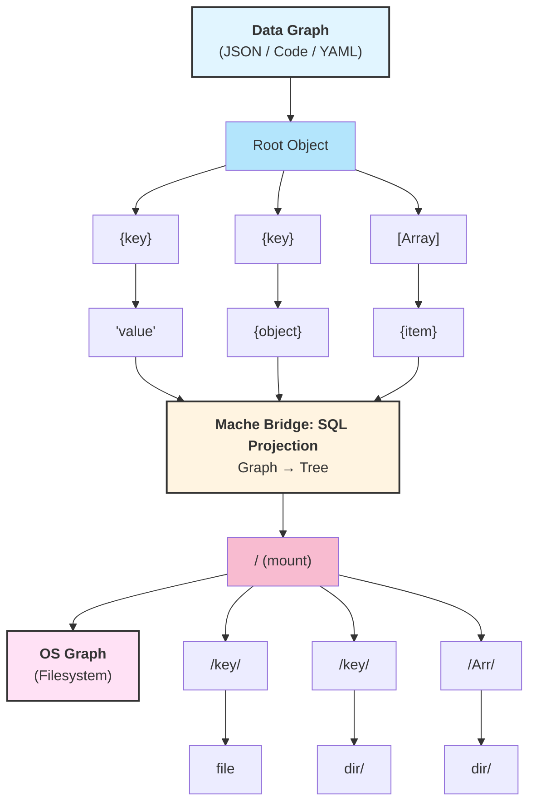

# 🗂️ Mache

[](https://github.com/agentic-research/mache/actions/workflows/ci.yml)
[](https://github.com/agentic-research/mache/actions/workflows/integration.yml)

> **Mache** (/mɑʃe/ *mah-shay*): From the French *mâché*, meaning **"crushed and ground"** (as in *papier-mâché*). Just as waste paper is shredded and remolded into strong, complex shapes, Mache remolds raw data into navigable filesystems.

## Mache: The Graph-Native Filesystem

**We realized that JSON, YAML, Source Code, and Filesystems are all just Graphs.**

Mache is the engine that aligns them. It treats your structured data not as text to be parsed, but as a Graph to be mounted. By bridging the gap between your Data's structure (ASTs, Objects) and your OS's structure (Directories, Inodes), Mache allows you to traverse complex logic as easily as you traverse a directory tree.

And because it's a Graph, Mache gives you the ultimate tool to query it: **SQL**.



### The Core Insight: Graph Isomorphism

Both structured data and filesystems are graphs. Your JSON object has nodes (keys, arrays) and edges (containment). Your filesystem has nodes (files, directories) and edges (parent-child relationships). They're the same structure.

The gap exists because operating systems never formalized this mapping. Mache does:

- **SQL is the graph operator.** Queries define projections from one graph topology to another.
- **Schema defines topology.** It's not configuration—it's the formal specification of how source nodes map to filesystem nodes.
- **FUSE exposes traversal primitives.**
  - `cd` traverses an edge
  - `ls` enumerates children
  - `cat` reads node data.

This isn't metaphorical. Mache literally treats both sides as graphs and uses SQL to transform one into the other.

---

## Table of Contents

- [Status](#status)
- [Feature Matrix](#feature-matrix)
- [Quick Start](#quick-start)
- [Usage](#usage)
  - [Example: NVD Vulnerability Database](#example-nvd-vulnerability-database)
  - [Example: Projecting JSON Data](#example-projecting-json-data)
  - [Example: Projecting Source Code](#example-projecting-source-code)
  - [Write-Back Mode](#write-back-mode)
- [How It Works](#how-it-works)
- [Documentation](#documentation)
- [Contributing](#contributing)
- [License](#license)

## Status

Mache is in **early development**. The core pipeline (schema + ingestion + FUSE mount) works end-to-end across multiple data sources.

## Feature Matrix

| Capability | Status | Notes |
| --- | --- | --- |
| **Graph Filesystem** | **Stable** | FUSE bridge (macOS/Linux) mounts any graph as a directory tree. |
| **Hybrid SQL Index** | **Active** | In-memory SQLite sidecar for instant, zero-copy queries. |
| **Plan 9 Interface** | **Live** | Synthetic `ctl` files for executing complex SQL via shell. |
| **Write-Back** | **Stable** | Atomic splicing with implicit truncation and diagnostics feedback loop. |
| **Context Awareness** | **Active** | Virtual `context` files expose global scope (imports/types) to agents. |
| **Tree-sitter Parsing** | **Active** | Native support for Go and Python ASTs. |
| **Schema Inference** | **Beta** | Recursive directory inference using Formal Concept Analysis (FCA). |

## Quick Start

### Prerequisites

- **macOS:** `brew install --cask fuse-t` and `brew install go-task`
- **Linux:** `apt-get install libfuse-dev` and [install Task](https://taskfile.dev/installation/)

### Building

```bash
git clone https://github.com/agentic-research/mache.git
cd mache

# Build (checks for fuse-t on macOS, builds and codesigns)
task build

# Run tests
task test
```

## Usage

```bash
# Mount a SQLite database (instant — zero-copy, direct SQL queries)
./mache --schema examples/nvd-schema.json --data results.db /tmp/nvd

# Mount with zero-config schema inference (no schema authoring needed)
./mache --infer --data results.db /tmp/nvd

# Mount a JSON file (ingests into memory)
./mache --schema schema.json --data data.json /tmp/mount
```

### Example: NVD Vulnerability Database

Mount 323K NVD CVE records as a browsable filesystem, sharded by year and month.
(Data can be generated using [Venturi](https://github.com/agentic-research/venturi)):

```bash
./mache --schema examples/nvd-schema.json \
        --data /path/to/nvd/results.db \
        /tmp/nvd
```

```
/tmp/nvd/
  by-cve/
    2024/
      01/
        CVE-2024-0001/
          description   # "A buffer overflow in FooBar..."
          published     # "2024-01-15T00:00:00Z"
          raw.json      # Full JSON record
```

### Example: Projecting JSON Data

Given a `data.json` with users, you can project it into a `users/` directory where each file contains specific fields.

### Example: Projecting Source Code

Mache auto-detects `.go` and `.py` files. Use tree-sitter queries in your schema to map AST nodes (functions, types) to directories.

- **Source:** The `source` file contains the function/type body.
- **Context:** The `context` file (virtual) contains imports, types, and global variables visible to that scope. This is critical for LLM agents to understand dependencies without reading the whole file.

### Write-Back Mode

With `--writable`, file nodes backed by tree-sitter source code become editable.

```bash
# Mount Go source with write-back enabled
./mache -w -s examples/go-schema.json -d . /tmp/mache-src
```

When you edit a file in the mount, Mache splices the content back into the original source file and runs `goimports`. It includes robust **Fail-Open** recovery: if you write syntax errors that break the parser, the node won't disappear; instead, a `BROKEN_<filename>` node appears, allowing you to read and fix your broken code.

### The Plan 9 Interface: SQL on Files

Mache exposes a special `.query/` directory at the root of the mount. You can create ad-hoc queries by writing SQL to a control file.

```bash
# 1. Create a query session
mkdir /tmp/mount/.query/my_search

# 2. Write your SQL query (selects paths where token 'Calculate' appears)
echo "SELECT path FROM mache_refs WHERE token = 'Calculate'" > /tmp/mount/.query/my_search/ctl

# 3. Read the results (symlinks to the actual nodes)
ls -l /tmp/mount/.query/my_search/
# -> main_Calculate_source -> ../../main/Calculate/source
```

## How It Works

Mache uses a **Topology Schema** to map data from SQLite, JSON, or source code into a filesystem structure.

1. **Direct Mode:** For SQLite, it queries the DB on-demand (zero-copy).
2. **Ingest Mode:** For JSON/Code, it loads data into an in-memory graph.
3. **Inference:** With `--infer`, it uses Formal Concept Analysis to guess the best folder structure.

See [Architecture](docs/ARCHITECTURE.md) for details.

## Documentation

- [Architecture & Design](docs/ARCHITECTURE.md) - Deep dive into internals, pipelines, and abstractions.
- [Roadmap](docs/ROADMAP.md) - Future plans and known limitations.
- [Example Schemas](examples/README.md) - Details on the included examples.
- [ADRs](docs/adr/) - Architectural Decision Records.

## Contributing

See [CONTRIBUTING.md](CONTRIBUTING.md) for details.

## License

Apache License 2.0. See [LICENSE](LICENSE).
