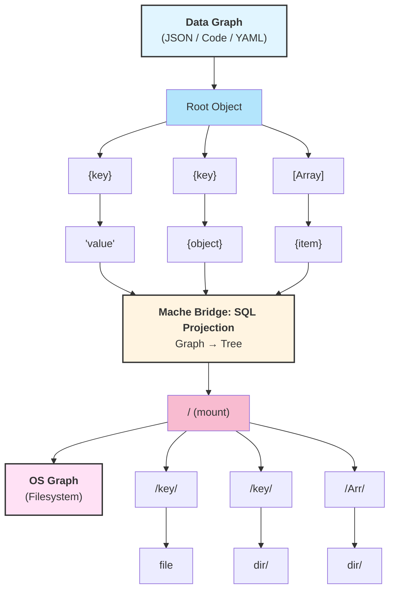

# Mache

[](https://github.com/agentic-research/mache/actions/workflows/ci.yml)
[](https://github.com/agentic-research/mache/actions/workflows/integration.yml)

An agent-computer interface for code and structured data.

Agents operate in environments without topology. They see flat files, grep for strings, and rebuild context every turn. Mache gives them the structure that's missing — a graph of functions, types, cross-references, and call chains, exposed over MCP or as a mounted filesystem. Agents navigate structure instead of searching for it. Outputs stay human-discernible; it's just directories and SQL.

> *Mache* (/mɑʃe/ *mah-shay*): from *papier-mâché* — raw material, crushed and remolded into shape.


## Install

```bash
brew install agentic-research/tap/mache
```

## Use with Claude Code

Add to your project's `.mcp.json`:

```json
{
  "mcpServers": {
    "mache": {
      "command": "mache",
      "args": ["serve", "--stdio", "."]
    }
  }
}
```

That's it. Mache auto-infers the schema from your codebase. No config files, no mount, no daemon.

Your agent gets 11 tools:

| Tool | What it does |
|------|-------------|
| `get_overview` | Top-level structure, node counts, entry points |
| `list_directory` | Browse the graph by path |
| `read_file` | Read source content (supports batch reads) |
| `find_definition` | Jump to where a symbol is defined |
| `find_callers` | Who calls this? |
| `find_callees` | What does this call? |
| `search` | Pattern match across symbols |
| `get_communities` | Find clusters of tightly-coupled code |
| `get_type_info` | LSP type info and hover data |
| `get_diagnostics` | LSP errors and warnings |
| `write_file` | Edit through the splice pipeline: validate, format, splice |

## Why this exists

Agents operate without topology. They see flat files, grep for strings, build a mental model, forget it next turn, rebuild it. The structure is *in* the data — functions call other functions, types reference types, configs depend on configs — but nothing exposes it.

Mache does. Point it at data, it figures out the shape. Source code gets parsed by tree-sitter. JSON and YAML get walked. Schema inference (via Formal Concept Analysis) discovers the natural groupings — `functions/`, `types/`, `classes/` — without you writing config. The agent can then explore the topology directly: follow call chains, find definitions, read context, write back.

The workflow: **point your agent at data → mache discovers the shape → agent explores structure instead of searching for it.**

This is built for agents first. The design choices — stable node paths across edits, POSIX as the universal interface, identity-preserving write-back — exist because agents need to reference things reliably across turns. The outputs are human-discernible because the representations are filesystems and SQL, but the topology is the point.

## Mount as a filesystem

Mache can also mount your data as a real directory tree. This works with any tool — `cat`, `ls`, `cd`, shell scripts, other agents.

```bash
# Mount source code (zero-config, writable)
mache --infer -d ./src --writable /tmp/mache-src

# Mount with agent mode (generates PROMPT.txt for LLMs)
mache --agent -d ~/my-project

# Mount a SQLite database (zero-copy)
mache --schema examples/nvd-schema.json --data results.db /tmp/nvd
```

What the mount looks like:

```
/tmp/mache-src/
  functions/
    HandleRequest/
      source        # the function body
      context       # imports, types visible to this scope
      callers/      # who calls this function
      callees/      # what this function calls
    ValidateToken/
      source
  types/
    Config/
      source        # type Config struct { ... }
  _project_files/
    README.md
    go.mod
```

Navigate by function name, not file path. `callers/` and `callees/` are virtual directories that appear only when references exist.

### Write-back

With `--writable`, edits to `source` files go through a pipeline before touching your actual source:

1. **Validate** — tree-sitter checks syntax
2. **Format** — gofumpt (Go), hclwrite (HCL)
3. **Splice** — atomic byte-range replacement in the source file
4. **Update** — node content updated in-place, no re-ingest

If the syntax is wrong, the write is saved as a draft. The node path stays stable. Errors show up in `_diagnostics/`. The agent can read what it broke and try again without losing its place.

## MCP server options

```bash
# stdio — Claude Code spawns mache as a subprocess (recommended)
mache serve --stdio .

# HTTP — runs independently, multiple clients
mache serve .
mache serve --http :9000 -s examples/nvd-schema.json results.db
```

<details>
<summary>Claude Code setup (detailed)</summary>

**Per-project (stdio)** — `.mcp.json`:

```json
{
  "mcpServers": {
    "mache": {
      "command": "mache",
      "args": ["serve", "--stdio", "."]
    }
  }
}
```

**Global** — `~/.claude/settings.json` with same format.

**HTTP (always-on)**:

```bash
mache serve /path/to/data &
claude mcp add --transport http mache http://localhost:7532/mcp
```
</details>

<details>
<summary>Claude Desktop setup</summary>

Add to `claude_desktop_config.json`:

```json
{
  "mcpServers": {
    "mache": {
      "command": "/path/to/mache",
      "args": ["serve", "--stdio", "/path/to/code"]
    }
  }
}
```
</details>

## How it works

- **Tree-sitter** parses source into AST nodes (Go, Python, JS, TS, Rust, SQL, HCL, YAML)
- **Schema inference** (Formal Concept Analysis) groups nodes into containers — `functions/`, `types/`, `classes/`
- **Cross-reference extraction** builds a call graph from identifiers and imports
- **SQL projection** maps the graph into a navigable tree

Three backends: MCP server (JSON-RPC), NFS mount (macOS default), FUSE mount (Linux default).

<details>
<summary>The graph isomorphism argument</summary>

Both structured data and filesystems are graphs. Your JSON object has nodes and edges (containment). Your filesystem has nodes and edges (parent-child). They're isomorphic.

Operating systems never formalized this mapping. Mache does:
- SQL is the graph operator — queries define projections from one topology to another
- Schema defines topology — the formal specification of how source nodes map to filesystem nodes
- The filesystem exposes traversal primitives: `cd` traverses an edge, `ls` enumerates children, `cat` reads node data


```mermaid
graph TD
    DH["<b>Data Graph</b><br/>(JSON / Code / YAML)"]

    root["Root Object"]
    root --> key1["{key}"]
    root --> key2["{key}"]
    root --> arr["[Array]"]
    key1 --> val["'value'"]
    key2 --> obj["{object}"]
    arr --> item["{item}"]

    bridge["<b>Mache Bridge: SQL Projection</b><br/>Graph → Tree"]

    OSH["<b>OS Graph</b><br/>(Filesystem)"]

    mount["/  (mount)"]
    mount --> dir1["/key/"]
    mount --> dir2["/key/"]
    mount --> dirArr["/Arr/"]
    dir1 --> file["file"]
    dir2 --> subdir["dir/"]
    dirArr --> itemdir["dir/"]

    DH --> root
    val --> bridge
    obj --> bridge
    item --> bridge
    bridge --> mount
    mount --> OSH

    style DH fill:#e1f5ff,stroke:#333,stroke-width:2px
    style bridge fill:#fff4e1,stroke:#333,stroke-width:2px
    style OSH fill:#ffe1f5,stroke:#333,stroke-width:2px
    style root fill:#b3e5fc
    style mount fill:#f8bbd0

```

See [Architecture](docs/ARCHITECTURE.md) for the full picture.
</details>

## What's stable, what's not

| Capability | Status |
| --- | --- |
| Tree-sitter parsing (8 langs) | Stable |
| NFS/FUSE mount | Stable |
| Write-back (validate, format, splice) | Stable |
| Cross-references (callers/callees) | Stable |
| Context files (imports, types, globals) | Stable |
| MCP server (11 tools, stdio + HTTP) | Stable |
| Schema inference (FCA) | Beta |
| Community detection (Louvain) | Beta |
| LSP enrichment (type info, diagnostics) | Beta |

## Landscape

See [Prior Art](docs/PRIOR_ART.md) for detailed comparisons with related tools.

<details>
<summary>Build from source</summary>

```bash
git clone https://github.com/agentic-research/mache.git
cd mache
task build            # requires: go-task, Go 1.23+
task install          # copies to ~/.local/bin
```

- **macOS:** `brew install go-task`
- **macOS (FUSE):** `brew install --cask fuse-t` (only if using `--backend fuse`)
- **Linux:** `apt-get install libfuse-dev` and [install Task](https://taskfile.dev/installation/)
</details>

## Docs

- [Architecture](docs/ARCHITECTURE.md)
- [Prior Art](docs/PRIOR_ART.md)
- [Roadmap](docs/ROADMAP.md)
- [Example Schemas](examples/README.md)
- [ADRs](docs/adr/)
- [Contributing](CONTRIBUTING.md)

## License

Apache 2.0
