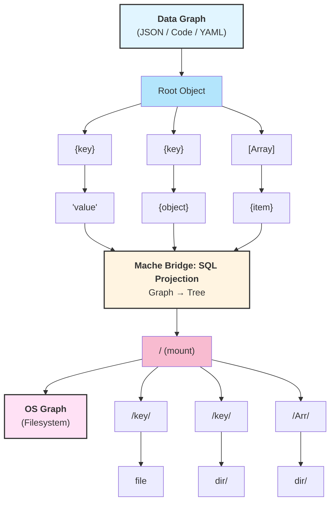

# Mache

[](https://github.com/agentic-research/mache/actions/workflows/ci.yml)
[](https://github.com/agentic-research/mache/actions/workflows/integration.yml)

**Structural code intelligence for AI agents.** Mache parses your codebase into a navigable graph — functions, types, cross-references, call chains — and exposes it as an MCP server or a real mounted filesystem. Your agent stops grepping through flat files and starts traversing structure.

> *Mache* (/mɑʃe/ *mah-shay*): From the French *mâché* — "crushed and ground," as in *papier-mâché*. Raw data, remolded into shape.


## Quick Start

```bash
brew install agentic-research/tap/mache
```

Add to your project's `.mcp.json`:

```json
{
  "mcpServers": {
    "mache": {
      "command": "mache",
      "args": ["serve", "--stdio", "."]
    }
  }
}
```

That's it. Your AI assistant now has 11 structural code intelligence tools. No schema, no config, no mount — mache auto-infers the structure from your codebase.

<details>
<summary>Build from source</summary>

```bash
git clone https://github.com/agentic-research/mache.git
cd mache
task build            # requires: go-task, Go 1.23+
task install          # copies to ~/.local/bin
```

Prerequisites:
- **macOS:** `brew install go-task` (NFS backend is built-in)
- **macOS (FUSE backend):** `brew install --cask fuse-t` (only if using `--backend fuse`)
- **Linux:** `apt-get install libfuse-dev` and [install Task](https://taskfile.dev/installation/)
</details>

## What You Get

Point mache at a Go project and ask your agent to call `get_overview`:

```
Source: ./internal/ (Go)
Nodes: 847 (312 functions, 89 types, 44 methods, ...)
Languages: go

Top-level structure:
  functions/    312 nodes
  types/         89 nodes
  methods/       44 nodes
  _project_files/ 23 files (README.md, go.mod, ...)

Key entry points:
  functions/main, functions/HandleRequest, functions/NewServer
```

Then `find_callers "HandleRequest"` to see who calls it. `find_callees "HandleRequest"` to see what it calls. `read_file "functions/HandleRequest"` to read the source. `get_type_info` for LSP hover data. `search "%auth%"` to find anything auth-related. All structural — no regex, no grep, no line numbers.

### Available Tools

| Tool | What it does |
|------|-------------|
| `get_overview` | Architecture snapshot: languages, node counts, entry points |
| `list_directory` | Browse the graph by path. Supports `exclude_tests` filter |
| `read_file` | Read source content. Supports batch reads via `paths` array |
| `find_definition` | Jump to where a symbol is defined |
| `find_callers` | Who calls this function? (incoming references) |
| `find_callees` | What does this function call? (outgoing references) |
| `search` | SQL LIKE pattern matching across symbols. Filter by `role` |
| `get_communities` | Discover clusters of tightly-coupled code (Louvain modularity) |
| `get_type_info` | LSP type info and hover data for a symbol |
| `get_diagnostics` | LSP errors and warnings for a file or symbol |
| `write_file` | Edit code through the splice pipeline: validate, format, splice, update |

## How It Works

Mache treats source code, JSON, YAML, and filesystems as the same thing: **graphs**. A function has children (parameters, body). A JSON object has children (keys, arrays). A directory has children (files, subdirectories). Same structure, different notation.

Mache bridges them:
- **Tree-sitter** parses source into AST nodes (8 languages: Go, Python, JS, TS, Rust, SQL, HCL, YAML)
- **Schema inference** (via Formal Concept Analysis) groups nodes into intuitive containers — `functions/`, `types/`, `classes/`
- **Cross-reference extraction** builds a call graph from identifiers and imports
- **SQL projection** maps the graph into a navigable tree (filesystem or MCP)

Three modes of operation:

1. **MCP Server** (`mache serve --stdio .`) — graph queried over JSON-RPC, no mount needed
2. **Filesystem Mount** (`mache --infer -d ./src /tmp/mount`) — browse code as directories via NFS/FUSE
3. **Direct SQLite** (`mache --schema schema.json --data results.db /tmp/data`) — zero-copy, instant mount

<details>
<summary>The graph isomorphism insight</summary>

Both structured data and filesystems are graphs. Your JSON object has nodes (keys, arrays) and edges (containment). Your filesystem has nodes (files, directories) and edges (parent-child). They're isomorphic.

The gap exists because operating systems never formalized this mapping. Mache does:
- **SQL is the graph operator.** Queries define projections from one topology to another.
- **Schema defines topology.** It's the formal specification of how source nodes map to filesystem nodes.
- **The filesystem exposes traversal primitives** (via NFS or FUSE): `cd` traverses an edge, `ls` enumerates children, `cat` reads node data.


```mermaid
graph TD
    DH["<b>Data Graph</b><br/>(JSON / Code / YAML)"]

    root["Root Object"]
    root --> key1["{key}"]
    root --> key2["{key}"]
    root --> arr["[Array]"]
    key1 --> val["'value'"]
    key2 --> obj["{object}"]
    arr --> item["{item}"]

    bridge["<b>Mache Bridge: SQL Projection</b><br/>Graph → Tree"]

    OSH["<b>OS Graph</b><br/>(Filesystem)"]

    mount["/  (mount)"]
    mount --> dir1["/key/"]
    mount --> dir2["/key/"]
    mount --> dirArr["/Arr/"]
    dir1 --> file["file"]
    dir2 --> subdir["dir/"]
    dirArr --> itemdir["dir/"]

    DH --> root
    val --> bridge
    obj --> bridge
    item --> bridge
    bridge --> mount
    mount --> OSH

    style DH fill:#e1f5ff,stroke:#333,stroke-width:2px
    style bridge fill:#fff4e1,stroke:#333,stroke-width:2px
    style OSH fill:#ffe1f5,stroke:#333,stroke-width:2px
    style root fill:#b3e5fc
    style mount fill:#f8bbd0

```

See [Architecture](docs/ARCHITECTURE.md) for the full deep dive.
</details>

## MCP Server Configuration

`mache serve` supports two transport modes:

- **stdio** (`--stdio`) — client spawns mache as a subprocess. Simplest setup.
- **Streamable HTTP** (default, `localhost:7532`) — mache runs independently. Supports multiple clients.

```bash
# stdio (recommended for Claude Code / Cursor)
mache serve --stdio .

# HTTP on default port
mache serve .

# HTTP on custom port
mache serve --http :9000 -s examples/nvd-schema.json results.db
```

<details>
<summary>Claude Code setup options</summary>

**Per-project (stdio)** — add to `.mcp.json`:

```json
{
  "mcpServers": {
    "mache": {
      "command": "mache",
      "args": ["serve", "--stdio", "."]
    }
  }
}
```

**Global (stdio)** — add to `~/.claude/settings.json`:

```json
{
  "mcpServers": {
    "mache": {
      "command": "/path/to/mache",
      "args": ["serve", "-s", "/path/to/schema.json", "/path/to/data"]
    }
  }
}
```

**Always-on (HTTP)**:

```bash
mache serve /path/to/data &
claude mcp add --transport http mache http://localhost:7532/mcp
```
</details>

<details>
<summary>Claude Desktop setup</summary>

Add to your `claude_desktop_config.json`:

```json
{
  "mcpServers": {
    "mache": {
      "command": "/path/to/mache",
      "args": ["serve", "-s", "/path/to/schema.json", "/path/to/data"]
    }
  }
}
```
</details>

## Filesystem Mount

Mache can also mount your data as a real POSIX filesystem. This is useful for agents that work best with standard file tools, or for interactive exploration.

```bash
# Mount source code (zero-config, writable)
mache --infer -d ./src --writable /tmp/mache-src

# Mount with agent mode (auto-generates PROMPT.txt for LLMs)
mache --agent -d ~/my-project

# Mount a SQLite database (instant, zero-copy)
mache --schema examples/nvd-schema.json --data results.db /tmp/nvd

# Mount a JSON file
mache --schema schema.json --data data.json /tmp/mount
```

When mounted, your codebase becomes a directory tree organized by structure:

```
/tmp/mache-src/
  functions/
    HandleRequest/
      source        # func HandleRequest(w http.ResponseWriter, r *http.Request) { ... }
      context       # imports, types visible to this scope
      callers/      # who calls this function
      callees/      # what this function calls
    ValidateToken/
      source
  types/
    Config/
      source        # type Config struct { ... }
  _project_files/
    README.md       # non-AST files preserved here
    go.mod
```

### Write-Back

With `--writable`, edits to `source` files splice back into your original source:

1. **Validate** — tree-sitter checks syntax
2. **Format** — gofumpt (Go), hclwrite (HCL) applied in-memory
3. **Splice** — atomic byte-range replacement in the source file
4. **Update** — node content updated in-place, no re-ingest
5. **Shift** — sibling node offsets adjusted automatically

Invalid writes are saved as **drafts** — the node path stays stable and errors appear in `_diagnostics/`. The agent can read its broken code and retry without losing the file path.

### Cross-Reference Navigation

Every function gets virtual `callers/` and `callees/` directories:

```bash
ls functions/HandleRequest/callers/
# → functions_Main_source  functions_Router_source

cat functions/HandleRequest/callees/functions_ValidateToken_source
# → func ValidateToken(tok string) error { ... }
```

Full bidirectional call-chain tracing through filesystem paths — no grep, no LSP, no IDE.

## Feature Status

| Capability | Status | Notes |
| --- | --- | --- |
| Tree-sitter Parsing | Stable | Go, Python, JS, TS, SQL, Rust, HCL/Terraform, YAML |
| Graph Filesystem | Stable | NFS (macOS) and FUSE (Linux) backends |
| Write-Back | Stable | Validate, format, splice. Go and HCL formatters |
| Cross-References | Stable | `callers/` and `callees/` virtual directories |
| Context Awareness | Stable | Virtual `context` files (imports, types, globals) |
| MCP Server | Stable | 11 tools over stdio or streamable HTTP |
| Schema Inference | Beta | Auto-infer via Formal Concept Analysis |
| Community Detection | Beta | Louvain modularity for discovering code clusters |
| LSP Enrichment | Beta | Type info and diagnostics via language servers |

## Landscape

| Tool | AST-Aware | Write-Back | Real FS Mount | MCP Server | Schema-Driven |
|------|:---:|:---:|:---:|:---:|:---:|
| **Mache** | 8 langs | Yes | NFS/FUSE | 11 tools | Yes |
| codebase-memory-mcp | 64 langs | No | No | 12 tools | No |
| AgentFS (Turso) | No | Yes | No | No | No |
| FUSE-DB tools | No | Some | Yes | No | No |
| Plan 9 / 9P | No | Yes | Yes | No | Yes |

Mache's differentiator: it's the only tool that combines AST decomposition, write-back, and a real mountable filesystem with an MCP interface. Where codebase-memory-mcp builds a persistent knowledge graph for token-efficient exploration, mache builds a live projection that you can write through.

See [Prior Art](docs/PRIOR_ART.md) for detailed comparisons.

## Documentation

- [Architecture & Design](docs/ARCHITECTURE.md)
- [Prior Art & Landscape](docs/PRIOR_ART.md)
- [Roadmap](docs/ROADMAP.md)
- [Example Schemas](examples/README.md)
- [ADRs](docs/adr/)

## Contributing

See [CONTRIBUTING.md](CONTRIBUTING.md) for details.

## License

Apache License 2.0. See [LICENSE](LICENSE).
