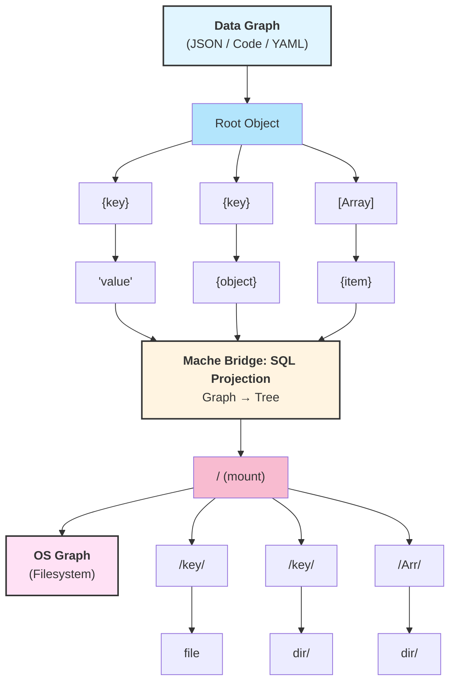

# 🗂️ Mache

[](https://github.com/agentic-research/mache/actions/workflows/ci.yml)
[](https://github.com/agentic-research/mache/actions/workflows/integration.yml)

> **Mache** (/mɑʃe/ *mah-shay*): From the French *mâché*, meaning **"crushed and ground"** (as in *papier-mâché*). Just as waste paper is shredded and remolded into strong, complex shapes, Mache remolds raw data into navigable filesystems.


## Mache: The Graph-Native Filesystem

**We realized that JSON, YAML, Source Code, and Filesystems are all just Graphs.**

Mache is the engine that aligns them. It treats your structured data not as text to be parsed, but as a Graph to be mounted. By bridging the gap between your Data's structure (ASTs, Objects) and your OS's structure (Directories, Inodes), Mache allows you to traverse complex logic as easily as you traverse a directory tree.

And because it's a Graph, Mache gives you the ultimate tool to query it: **SQL**.


```mermaid
graph TD
    DH["<b>Data Graph</b><br/>(JSON / Code / YAML)"]

    root["Root Object"]
    root --> key1["{key}"]
    root --> key2["{key}"]
    root --> arr["[Array]"]
    key1 --> val["'value'"]
    key2 --> obj["{object}"]
    arr --> item["{item}"]

    bridge["<b>Mache Bridge: SQL Projection</b><br/>Graph → Tree"]

    OSH["<b>OS Graph</b><br/>(Filesystem)"]

    mount["/  (mount)"]
    mount --> dir1["/key/"]
    mount --> dir2["/key/"]
    mount --> dirArr["/Arr/"]
    dir1 --> file["file"]
    dir2 --> subdir["dir/"]
    dirArr --> itemdir["dir/"]

    DH --> root
    val --> bridge
    obj --> bridge
    item --> bridge
    bridge --> mount
    mount --> OSH

    style DH fill:#e1f5ff,stroke:#333,stroke-width:2px
    style bridge fill:#fff4e1,stroke:#333,stroke-width:2px
    style OSH fill:#ffe1f5,stroke:#333,stroke-width:2px
    style root fill:#b3e5fc
    style mount fill:#f8bbd0

```

### The Core Insight: Graph Isomorphism

Both structured data and filesystems are graphs. Your JSON object has nodes (keys, arrays) and edges (containment). Your filesystem has nodes (files, directories) and edges (parent-child relationships). They're the same structure.

The gap exists because operating systems never formalized this mapping. Mache does:

- **SQL is the graph operator.** Queries define projections from one graph topology to another.
- **Schema defines topology.** It's not configuration—it's the formal specification of how source nodes map to filesystem nodes.
- **The filesystem exposes traversal primitives** (via NFS or FUSE):
  - `cd` traverses an edge
  - `ls` enumerates children
  - `cat` reads node data

This isn't metaphorical. Mache literally treats both sides as graphs and uses SQL to transform one into the other.

---

## Table of Contents

- [Status](#status)
- [Feature Matrix](#feature-matrix)
- [Quick Start](#quick-start)
- [Usage](#usage)
  - [MCP Server Mode](#mcp-server-mode)
  - [Example: NVD Vulnerability Database](#example-nvd-vulnerability-database)
  - [Example: Projecting JSON Data](#example-projecting-json-data)
  - [Example: Projecting Source Code](#example-projecting-source-code)
  - [Write-Back Mode](#write-back-mode)
  - [Cross-Reference Navigation](#cross-reference-navigation)
- [How It Works](#how-it-works)
- [Landscape](#landscape)
- [Documentation](#documentation)
- [Contributing](#contributing)
- [License](#license)

## Status

Mache is in **active development**. The core pipeline (schema + ingestion + mount) works end-to-end across multiple data sources.

## Feature Matrix

| Capability | Status | Notes |
| --- | --- | --- |
| **Graph Filesystem** | **Stable** | NFS (macOS default) and FUSE (Linux default) backends. |
| **Hybrid SQL Index** | **Stable** | In-memory SQLite sidecar for instant, zero-copy queries via `/.query/`. |
| **Write-Back** | **Stable** | Identity-preserving: validate → format → splice → surgical node update. Formatting: gofumpt (Go), hclwrite (HCL/Terraform). No re-ingest on write. |
| **Draft Mode** | **Stable** | Invalid writes save as drafts; node path stays stable. Diagnostics via `_diagnostics/`. |
| **Context Awareness** | **Stable** | Virtual `context` files expose global scope (imports/types) to agents. |
| **Tree-sitter Parsing** | **Stable** | Go, Python, JavaScript, TypeScript, SQL, Rust, HCL/Terraform, YAML. |
| **Cross-References** | **Stable** | `callers/` and `callees/` virtual dirs for bidirectional call-chain navigation. |
| **`_project_files/`** | **Stable** | Non-AST files (READMEs, configs, docs) preserved in separate tree during source mounts. |
| **Schema Inference** | **Beta** | Auto-infer schema from data via Formal Concept Analysis (FCA). Friendly-name grouping (`functions/`, `types/`, `classes/`). |
| **MCP Server** | **Beta** | `mache serve` exposes any graph as an MCP server over stdio. 9 tools: list, read, callers, callees, definition, search, communities, overview, write. |
| **Community Detection** | **Beta** | Louvain modularity optimization discovers densely co-referencing node clusters from the refs graph. |

## Quick Start

### Prerequisites

- **macOS:** `brew install go-task` (NFS backend is built-in, no fuse-t needed)
- **macOS (FUSE backend):** `brew install --cask fuse-t` (only if using `--backend fuse`)
- **Linux:** `apt-get install libfuse-dev` and [install Task](https://taskfile.dev/installation/)

### Building

```bash
git clone https://github.com/agentic-research/mache.git
cd mache

# Build (checks for fuse-t on macOS, builds and codesigns)
task build

# Run tests
task test
```

## Usage

### Basic Commands

```bash
# Mount a SQLite database (instant — zero-copy, direct SQL queries)
./mache --schema examples/nvd-schema.json --data results.db /tmp/nvd

# Mount with zero-config schema inference (no schema authoring needed)
./mache --infer --data results.db /tmp/nvd

# Mount a JSON file (ingests into memory)
./mache --schema schema.json --data data.json /tmp/mount

# Mount source code with write-back (edits splice back into source files)
./mache --infer --data ./src --writable /tmp/mache-src

# Explicitly select backend (default: nfs on macOS, fuse on Linux)
./mache --backend nfs --infer --data results.db /tmp/nvd
```

### MCP Server Mode

`mache serve` exposes any mache graph as an [MCP](https://modelcontextprotocol.io/) server, usable by Claude Code, Claude Desktop, Cursor, or any MCP client.

Two transport modes:

- **Streamable HTTP** (default, `localhost:7532`) — mache runs as an independent process. Supports stateful sessions and multiple clients. Best for always-on services (e.g. `brew services`, `launchd`).
- **stdio** (`--stdio`) — client spawns mache as a subprocess. For direct piping or legacy MCP clients.

```bash
# Streamable HTTP on localhost:7532 (default)
mache serve -s examples/go-schema.json ./internal/

# HTTP on custom port
mache serve --http :9000 -s examples/nvd-schema.json results.db

# stdio (subprocess mode)
mache serve --stdio -s examples/go-schema.json ./internal/
```

Nine tools are exposed: `list_directory`, `read_file`, `find_callers`, `find_callees`, `find_definition`, `search`, `get_communities`, `get_overview`, and `write_file`. No filesystem mount needed — the graph is queried directly over JSON-RPC.

#### Installing in Claude Code

**Option A: stdio (per-project)**

Add to your project's `.mcp.json` (or `~/.claude/settings.json` for global access):

```json
{
  "mcpServers": {
    "mache": {
      "command": "/path/to/mache",
      "args": ["serve", "-s", "/path/to/schema.json", "/path/to/data"]
    }
  }
}
```

**Option B: Streamable HTTP (always-on)**

Start the server, then register it:

```bash
mache serve /path/to/data &
claude mcp add --transport http mache http://localhost:7532/mcp
```

Or add to `.mcp.json`:

```json
{
  "mcpServers": {
    "mache": {
      "type": "http",
      "url": "http://localhost:7532/mcp"
    }
  }
}
```

Example — serve your own Go codebase to Claude Code:

```json
{
  "mcpServers": {
    "my-project": {
      "command": "/path/to/mache",
      "args": ["serve", "-s", "examples/go-schema.json", "./src"]
    }
  }
}
```

#### Installing in Claude Desktop

Add to your `claude_desktop_config.json`:

```json
{
  "mcpServers": {
    "mache": {
      "command": "/path/to/mache",
      "args": ["serve", "-s", "/path/to/schema.json", "/path/to/data"]
    }
  }
}
```

#### Available MCP Tools

| Tool | Description |
|------|-------------|
| `list_directory` | List children of a directory node (empty path for root). Supports `exclude_tests` filter. |
| `read_file` | Read text content of a file node. Returns source origin metadata (file, byte range) for source-backed nodes. Supports batch reads via `paths` array. |
| `find_callers` | Find all nodes referencing a given symbol or token |
| `find_callees` | Find all symbols called by a given construct |
| `find_definition` | Look up the definition site of a symbol by name |
| `search` | Search for symbols matching a SQL LIKE pattern (e.g., `%auth%`). Supports `role` filter (caller/definition). |
| `get_communities` | Detect clusters of densely co-referencing nodes (Louvain modularity). Paginated. |
| `get_overview` | Architecture overview: top-level structure, node counts, and key entry points |
| `write_file` | Write new content via the splice pipeline: validate (tree-sitter) → format → atomic splice → update graph |

`search`, `get_communities`, `find_definition`, and `write_file` are conditionally available depending on backend capabilities.

### Using with LLMs and Agents

Mache mounts as a **standard POSIX filesystem** — no special tooling required. LLMs can use normal file operations.

**Quick Start - Agent Mode:**

```bash
# Auto-mount your codebase with one command
mache --agent -d ~/my-project

# Mache will:
# - Auto-infer schema from your code
# - Enable write-back for editing
# - Mount to /tmp/mache/my-project-abc123/
# - Generate PROMPT.txt with instructions for your LLM
# - Track the mount with git-aware naming

# The mount runs in the foreground. Open a new terminal and:
cd /tmp/mache/my-project-abc123
cat PROMPT.txt    # Read agent instructions
claude            # Start your LLM

# When done, press Ctrl+C in the mache terminal, or:
mache unmount my-project-abc123

# List all active mounts anytime:
mache list

# Clean up stale mounts:
mache clean
```

**Manual Mode (full control):**

```bash
# 1. Mount your codebase
mache --infer --data ~/my-project --writable /tmp/project

# 2. Navigate and work inside the mount
cd /tmp/project

# 3. Use any LLM with standard file tools (Read, Write, Edit)
claude
# or: aider, cursor, copilot, etc.
```

**Key Points for Agents:**
- **It's just files.** Use standard Read/Write/Edit tools — no special bash commands needed.
- **Structure mirrors semantics.** Navigate by function name, not file path: `cd functions/HandleRequest/`
- **Friendly-name grouping.** Schema inference creates intuitive containers — `functions/`, `types/`, `classes/` — instead of raw AST node types.
- **Virtual files provide context:**
  - `source` — the function/type body (AST node content)
  - `context` — imports, types, globals visible to this scope
  - `callers/` — directory of functions that call this one (incoming cross-references)
  - `callees/` — directory of functions this one calls (outgoing cross-references)
  - `_diagnostics/` — write status, AST errors, lint output
  - `_project_files/` — non-AST files (READMEs, configs, docs) preserved in a separate tree
- **Write-back preserves identity.** Edit `source` files and changes splice back into the original source tree. Invalid writes save as drafts in `_diagnostics/ast-errors`.

**Important: Writes only work on AST-backed `source` files.** Raw text files and virtual files are read-only. If a write fails validation (syntax error), the node path stays stable and the error is available in `_diagnostics/` so the agent can retry.

### Example: NVD Vulnerability Database

Mount 323K NVD CVE records as a browsable filesystem, sharded by year and month.
(Data can be generated using [Venturi](https://github.com/agentic-research/venturi)):

```bash
./mache --schema examples/nvd-schema.json \
        --data /path/to/nvd/results.db \
        /tmp/nvd
```

```
/tmp/nvd/
  by-cve/
    2024/
      01/
        CVE-2024-0001/
          description   # "A buffer overflow in FooBar..."
          published     # "2024-01-15T00:00:00Z"
          raw.json      # Full JSON record
```

### Example: Projecting JSON Data

Given a `data.json` with an array of records, a schema maps fields to directories and files:

```bash
./mache --schema examples/users-schema.json --data users.json /tmp/users
```

```
/tmp/users/
  by-name/
    alice/
      email       # "alice@example.com"
      role        # "admin"
      raw.json    # Full JSON record
    bob/
      email       # "bob@example.com"
      role        # "user"
      raw.json
```

The schema controls which field becomes the directory name (`name`), which fields become leaf files (`email`, `role`), and how records are grouped.

### Example: Projecting Source Code

Mache auto-detects source files (`.go`, `.py`, `.js`, `.ts`, `.rs`, `.tf`, `.hcl`, `.yaml`, `.sql`). Use tree-sitter queries in your schema to map AST nodes (functions, types) to directories.

With `--infer`, schema inference creates **friendly-name container directories** — grouping constructs by type with intuitive names:

```
/tmp/mache-src/
  functions/
    HandleRequest/
      source        # func HandleRequest(w http.ResponseWriter, r *http.Request) { ... }
      context       # imports, types visible to this scope
      callers/      # who calls this function
      callees/      # what this function calls
    ValidateToken/
      source
  types/
    Config/
      source        # type Config struct { ... }
  _project_files/
    README.md       # non-AST files preserved here
    go.mod
```

- **Source:** The `source` file contains the function/type body.
- **Context:** The `context` file (virtual) contains imports, types, and global variables visible to that scope. This is critical for LLM agents to understand dependencies without reading the whole file.
- **`_project_files/`:** Non-AST files (READMEs, configs, build files) are automatically routed into a separate tree so they remain accessible without polluting the AST structure.

### Write-Back Mode

With `--writable` (`-w`), file nodes backed by tree-sitter source code become editable.

```bash
# Mount Go source with write-back enabled
./mache -w --infer -d ./src /tmp/mache-src
```

The write-back pipeline is **identity-preserving** — node paths stay stable across writes:

1. **Validate** — tree-sitter checks syntax before touching the source file
2. **Format** — gofumpt formats Go buffers in-memory (no external CLI, no offset drift)
3. **Splice** — atomic byte-range replacement in the source file
4. **Surgical update** — node content and origin updated in-place (no full re-ingest)
5. **Shift siblings** — adjacent node offsets adjusted to match the new file layout

If validation fails, the write is saved as a **draft** — the node path remains stable, and the error is available via `_diagnostics/ast-errors`. The agent can read its broken code and fix it without losing the file path.

### Cross-Reference Navigation

Mache exposes bidirectional cross-references as virtual directories. For any function or type:
- **`callers/`** lists every node that references it — "who calls this?"
- **`callees/`** lists every function it calls — "what does this call?"

```bash
# What calls HandleRequest?
ls /functions/HandleRequest/callers/
# → functions_Main_source  functions_Router_source

# Read the calling code directly
cat /functions/HandleRequest/callers/functions_Main_source
# → func Main() { ... HandleRequest(ctx) ... }

# What does HandleRequest call?
ls /functions/HandleRequest/callees/
# → functions_ValidateToken_source  functions_WriteResponse_source

# Read callee source
cat /functions/HandleRequest/callees/functions_ValidateToken_source
# → func ValidateToken(tok string) error { ... }
```

Both directories are **self-gating** — they only appear when a function actually has callers or callees. No flag needed. This works on both NFS and FUSE backends, for both source code and SQLite mounts with cross-reference data.

Combined with `cat /functions/HandleRequest/source` for the definition, you get full bidirectional call-chain tracing through filesystem paths alone — no grep, no LSP, no IDE required.

## How It Works

Mache uses a **Topology Schema** to map data from SQLite, JSON, or source code into a filesystem structure.

1. **Direct Mode:** For SQLite, it queries the DB on-demand (zero-copy).
2. **Ingest Mode:** For JSON/Code, it loads data into an in-memory graph.
3. **Inference:** With `--infer`, it uses Formal Concept Analysis to guess the best folder structure.

See [Architecture](docs/ARCHITECTURE.md) for details.

## Landscape

Mache occupies a unique position: it's a **projection engine** that maps structured data into a real, mounted filesystem. Schemas can be hand-authored or auto-inferred via FCA. Most tools in the AI-agent ecosystem solve adjacent problems — context retrieval (RAG), protocol plumbing (MCP), or agent orchestration — but none combine schema-driven projection, AST decomposition, write-back, and a real POSIX mount.

| Tool | Schema-Driven | AST-Aware | Write-Back | Real FS Mount | MCP Server |
|------|:---:|:---:|:---:|:---:|:---:|
| **Mache** | Yes | Yes (8 langs) | Yes | Yes (NFS/FUSE) | Yes (9 tools) |
| codebase-memory-mcp | No | Yes (64 langs) | No | No | Yes (12 tools) |
| AgentFS (Turso) | No | No | Yes | No | No |
| Dust | No | No | No | No (synthetic) | No |
| MCP | No | No | Varies | No (protocol) | — |
| LlamaIndex / LangChain | No | No | No | No | No |
| FUSE-DB tools (FusqlFS, DBFS) | No | No | Some | Yes | No |
| Plan 9 / 9P | Yes | No | Yes | Yes | No |

Plan 9's "everything is a file server" philosophy is the closest historical precedent — Mache applies that idea to structured data with modern AST awareness. FUSE-DB tools mirror database schemas directly as directories; Mache adds a projection layer that reshapes data into task-appropriate topologies.

See [Prior Art](docs/PRIOR_ART.md) for a full landscape analysis with detailed comparisons and academic references.

## Documentation

- [Architecture & Design](docs/ARCHITECTURE.md) - Deep dive into internals, pipelines, and abstractions.
- [Prior Art & Landscape](docs/PRIOR_ART.md) - Comparison with related tools and academic context.
- [Roadmap](docs/ROADMAP.md) - Future plans and known limitations.
- [Example Schemas](examples/README.md) - Details on the included examples.
- [ADRs](docs/adr/) - Architectural Decision Records.

## Contributing

See [CONTRIBUTING.md](CONTRIBUTING.md) for details.

## License

Apache License 2.0. See [LICENSE](LICENSE).
