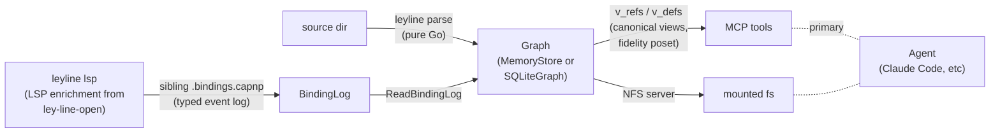

# Mache

Mache projects structured data into a navigable graph. Point a declarative schema at any structured source — JSON documents, SQLite databases, source code — and mache exposes the projection as MCP tools or a mounted filesystem, so an agent (or you) can explore the topology instead of grepping flat files.

One engine, many projections. The schemas in [`examples/`](examples/README.md) project CVE feeds (NVD, KEV), Notion exports, Trivy scan results, Terraform, Markdown, LLM conversation logs, and audit trails with the same machinery that projects Go or Rust source. **Code intelligence is the flagship application of that engine** — the most-developed projection, where the graph gains functions, types, cross-references, call chains, structural smell rules, and optional LSP-grade enrichment.

> *Mache* (/mɑʃe/ *mah-shay*): from *papier-mâché* — raw material, crushed and remolded into shape.


## Quick start

```bash
git clone https://github.com/agentic-research/mache.git
cd mache && task build && task install
mache init --global   # installs the keepalive HTTP daemon (:7532) + registers detected editors
```

That's the 30-second path for the flagship application — code intelligence on a **Go** codebase. `mache init --global` installs a per-user supervisor (launchd on macOS, systemd `--user` on Linux) that keeps the shared mache HTTP daemon alive on `localhost:7532` and registers it with Claude Code and any detected editors — no terminal to babysit. Then `mache init` (no flag) inside a project records what that project serves.

Two things new users hit:

- **HTTP is the canonical transport.** One shared daemon serves every project, routing per session via the MCP roots protocol. `--stdio` exists only as an escape hatch for CI / sandboxes / headless agents and is never registered for editor use (see [ADR-0022](docs/adr/0022-mcp-transport-canonical.md)).
- **[ley-line-open](https://github.com/agentic-research/ley-line-open) is a hard requirement, not an add-on.** Since v0.18.0 mache has no in-process parser: `leyline parse` produces the `_ast` database that every source projection reads. `task install` provisions the pinned binary from a checkout; `mache install` does the same from a release asset or package-manager install, where there is no Taskfile. Point mache at a directory *or* a pre-built `.db` — both route through leyline; a pre-built `.db` just skips the parse step and can carry LSP/embedding enrichment.

To project non-code data instead, hand `mache serve` (or the root mount form, `mache <mountpoint>`) a schema with `--schema` and point it at your JSON or SQLite source — the [example schemas](examples/README.md) cover NVD, KEV, Notion, Trivy, Terraform, and more.

For the full first-run flow — source choice (directory vs `.db` vs live hot-swap), the `--stdio` escape hatch, `--scope`, Claude Desktop, mount as filesystem, write-back, schema inference, troubleshooting — see [GETTING-STARTED.md](GETTING-STARTED.md).

## Code intelligence: what it gives an agent

The code projection is where the engine is deepest. **19 MCP tools** wrap the projected graph — 18 read-surface plus `write_file`.

| What you get                                | Tools                                                                     | Tier         | Status                                                |
| ------------------------------------------- | ------------------------------------------------------------------------- | ------------ | ----------------------------------------------------- |
| **Parse** source into a graph               | —                                                                         | required     | Stable — 27 of 28 languages (all but cue: no grammar) |
| **Orient** in an unfamiliar repo            | `get_overview`, `get_architecture`, `get_diagram`                         | base         | Stable                                                |
| **Cluster** related code                    | `get_communities`                                                         | base         | *Beta* — Louvain                                      |
| **Navigate** by structure, not string match | `find_definition`, `list_directory`, `read_file`, `resolve_ref`, `search` | base         | Stable                                                |
| **Trace** reference flow, both directions   | `find_callers`, `find_callees`, `get_impact`, `get_dataflow`              | base         | Stable — edges are explicitly `node_ref` evidence     |
| **Judge** structural quality                | `find_smells` — 14 rules                                                  | base¹        | Stable — `fan_out_skew` is qualifier-aware            |
| **Edit** without breaking the file          | `write_file` — validate → format → splice, draft mode on reject           | base         | Stable                                                |
| **Types + diagnostics** from a real LSP     | `get_type_info`, `get_diagnostics`                                        | + LSP pass   | Stable, optional tier                                 |
| **Search by meaning**, not tokens           | `semantic_search`                                                         | + embeddings | Stable, optional tier                                 |
| **Check enrichment freshness**              | `get_sheaf_status`                                                        | any²         | Stable                                                |
| **Serve across repos**                      | *(`--mount NAME=PATH`)*                                                   | base         | Stable — `find_callers` federates; callees per-mount  |
| **Mount as a filesystem** + write back      | *(NFS)*                                                                   | base         | Stable                                                |
| **Move a built graph** between machines/CI  | *(`mache cache` push/pull/verify)*                                        | —            | Stable — content-addressed, local dir or OCI          |
| **Infer a schema** from data                | *(`--infer`)*                                                             | —            | *Beta* — FCA + greedy entropy                         |

**Tiers.** There is no "works without ley-line-open" tier — `leyline parse` *is* the parser.

- **base** — any source projection. `leyline parse` → `_ast` → pure-Go `ASTWalker`, from a directory or a pre-built `.db`.
- **+ LSP pass** — leyline's LSP tier, auto-spawned on demand (pass a `file=`) or pre-baked into a `.db`. Drives the real language server (rust-analyzer, gopls, …); verified end-to-end on **Rust and Go**. Same primitive [Serena](https://github.com/oraios/serena) is built on, but as an enrichment *tier* over the `_ast` base rather than the foundation.
- **+ embeddings** — a ley-line-open-built `.db` carrying embedding vectors.

¹ 5 of the 14 rules need an enriched `.db`.  ² Reports daemon cache state; returns `{available: false}` when unreachable, so it's safe to call anywhere.

Internal machinery — canonical `v_refs`/`v_defs` views (ADR-0013), the capnp event-log readthrough, snapshot memoization, the e2e tool/flamegraph harness — lives in [ARCHITECTURE.md](docs/ARCHITECTURE.md) and [CHANGELOG.md](CHANGELOG.md).

For which tools read which tables, see [ARCHITECTURE.md § MCP Server](docs/ARCHITECTURE.md#core-abstractions) and [§ Interplay with ley-line-open](docs/ARCHITECTURE.md#interplay-with-ley-line-open).

## How it works

<details>
<summary>Schema → walkers → graph → MCP / filesystem (with diagram)</summary>

Every projection follows the same shape: a schema declares the topology, walkers extract nodes and edges from the source (JSONPath for JSON, direct SQL for SQLite, AST queries for code), and the resulting graph is served over MCP or mounted as a filesystem. The source-code path — the most developed — looks like this:


```mermaid
flowchart LR
    Source["source dir"] -->|"leyline parse<br/>(pure Go)"| Graph
    LSP["leyline lsp<br/>(LSP enrichment from<br/>ley-line-open)"] -->|"sibling .bindings.capnp<br/>(typed event log)"| BindingLog
    BindingLog -->|"ReadBindingLog"| Graph["Graph<br/>(MemoryStore or<br/>SQLiteGraph)"]
    Graph -->|"v_refs / v_defs<br/>(canonical views,<br/>fidelity poset)"| MCP["MCP tools"]
    Graph -->|"NFS server"| FS["mounted fs"]
    MCP -. "primary" .- Agent["Agent<br/>(Claude Code, etc)"]
    FS -.- Agent
```

1. **Parse** — `leyline parse` (from ley-line-open) turns source into an `_ast` database. mache reads it pure-Go via the `ASTWalker`; in-process CGO tree-sitter was removed in [ADR-0012](docs/adr/0012-cgo-removal-migration.md) step 4.
1. **Infer** — schema inference (FCA + greedy entropy) discovers the natural groupings (`functions/`, `types/`, `classes/`)
1. **Link** — cross-reference extraction builds a call graph from identifiers and imports. When the LSP pass from ley-line-open has run, refs flow through a sibling `.bindings.capnp` typed event log (per [ADR-0013](docs/adr/0013-refs-defs-canonical-schema.md)) rather than SQL columns — the wire format is the cross-runtime contract.
1. **Project** — the graph is exposed as MCP tools (primary) or a mounted filesystem (optional)

The graph is the same on either path; MCP and the filesystem are two ways to talk to it.

</details>

<details>
<summary>Why this exists</summary>

Agents operate without topology. They see flat files, grep for strings, build a mental model, forget it next turn, rebuild it. The structure is *in* the data — functions call other functions, types reference types, configs depend on configs — but nothing exposes it.

Mache does. Point it at data, it figures out the shape. Source code gets parsed by `leyline parse`. JSON and YAML get walked. Schema inference discovers the natural groupings without config. The agent can then explore the topology directly: follow call chains, find definitions, read context, write back.

Built for agents first. The design choices — stable node paths across edits, identity-preserving write-back — exist because agents need to reference things reliably across turns. The outputs are human-discernible because the representations are filesystems and SQL, but the topology is the point.

</details>

<details>
<summary>The graph isomorphism argument</summary>

Both structured data and filesystems are graphs. Your JSON object has nodes and edges (containment). Your filesystem has nodes and edges (parent-child). They're isomorphic.

Operating systems never formalized this mapping. Mache does:

- SQL is the graph operator — queries define projections from one topology to another
- Schema defines topology — the formal specification of how source nodes map to filesystem nodes
- The filesystem exposes traversal primitives: `cd` traverses an edge, `ls` enumerates children, `cat` reads node data

[ADR-0011](docs/adr/0011-pointer-abstraction.md) takes this further: every navigable thing in mache (path, token, SHA, range, record, ref) is a Pointer; the graph is a network of pointers; mache resolves them on demand.

See [Architecture](docs/ARCHITECTURE.md) for the full picture.

</details>

## Public Go API

Library callers can produce either a raw leyline database or a Mache
schema-projected database without invoking the `mache` CLI:

```go
import (
	"github.com/agentic-research/mache/build"
	"github.com/agentic-research/mache/schema"
)

// Resolve a bundled preset or a schema file relative to the project.
resolved, err := schema.Resolve("go", projectDir)
if err != nil {
	return err
}

// Use the resolved topology directly...
if err := build.ParseWithSchema(projectDir, outputDB, resolved.Topology); err != nil {
	return err
}

// ...or let build preserve preset metadata used by the grammar guard.
return build.ParseWithSchemaRef(projectDir, outputDB, "go", projectDir)
```

`build.Parse` writes leyline's raw parse shape. `ParseWithSchema` and
`ParseWithSchemaRef` additionally run Mache's `Engine` + `ASTWalker`
projection, including the registered `env:`, `mod:`, and `gomod:` reference
extractors. All paths invoke the pinned leyline executable and keep Mache
CGO-free. Address-reference extraction uses leyline's root-relative source IDs,
so files below the source root participate in the same graph as root files.

## Running the pinned leyline (mache-19326d)

<details>
<summary><code>mache leyline path</code> / <code>mache leyline exec</code> — reach the exact pinned binary without touching PATH</summary>

mache pins an exact ley-line-open release and caches it version-namespaced under `~/.mache/bin`, which is **not** on PATH. So a bare `leyline` in your shell runs whatever copy PATH happens to hold — often an older one — against `.db` files mache parsed with the pin. Both are named `leyline`; neither warns. Since leyline v0.13.0 shipped `leyline cdc enable` / `leyline cdc gc`, invoking leyline directly is a real workflow, so this is a real skew.

Two subcommands make the version question unaskable instead of answered-by-PATH-convention:

```bash
# Absolute path of the pinned binary, and nothing else on stdout.
mache leyline path

# Compose it — version-correct by construction.
$(mache leyline path) cdc enable --db ./mache.db

# Or proxy straight through: args, stdin/stdout/stderr and exit status forwarded.
mache leyline exec -- cdc enable --db ./mache.db
mache leyline exec cdc gc --db ./mache.db
```

Both resolve through mache's pin-checked chokepoint, so a non-pinned `leyline` earlier on PATH is reported on stderr and ignored rather than silently used. Neither mutates PATH, your shell rc, or the unversioned `~/.mache/bin/leyline` path (which stays never-written — see [`internal/leyline/binary_cache_path.go`](internal/leyline/binary_cache_path.go)).

`MACHE_NO_LEYLINE=1` still disables provisioning; `MACHE_LEYLINE_BINARY` still overrides the pin for LLO development.

</details>

## Portable cache (mache-aeb262)

<details>
<summary>Content-addressed <code>.db</code> bundles — push/pull/verify, OCI transport</summary>

`mache cache` push/pulls the projected `.db` as a content-addressed bundle so CI / new dev machines / agents don't re-parse a million lines on every cold start.

```bash
# Emit a portable bundle from a built db.
mache cache push --db ./mache.db ./cache-out

# Restore a fresh db from a bundle.
mache cache pull --out-db ./restored.db ./cache-out

# Push to a remote OCI registry (build-cache/v1 transport).
mache cache push --db ./mache.db ./cache-out \
    --remote https://cache.example.com --scope myrepo/abc123 --tag latest

# Pull from a remote registry into a local cache dir, then restore.
mache cache pull --out-db ./restored.db ./cache-in \
    --remote https://cache.example.com --scope myrepo/abc123 --ref latest

# CI-friendly: assert a bundle is intact + verifiable, without restoring.
mache cache verify \
    --remote https://cache.example.com --scope myrepo/abc123 --ref latest
```

When the source db has an `_ast` table, chunks carry the AST node rows too — pull restores both `_source` AND `_ast`, so the restored db is queryable without re-parsing. When `_ast` is absent, chunks are raw source bytes (Phase 1 fallback).

See [`docs/cache/phase-4-chunk-shape.md`](docs/cache/phase-4-chunk-shape.md) for the wire format and [`cloister-spec/build-cache/v1/`](https://github.com/agentic-research/cloister/tree/main/cloister-spec/build-cache/v1) for the OCI transport spec.

</details>

## Deployment modes

<details>
<summary>Bundle / OCI image (production) vs local dev</summary>

Mache has two supported deployment shapes:

**Bundle / image (canonical production path).** Mache ships its own
[apko](https://github.com/chainguard-dev/apko) +
[melange](https://github.com/chainguard-dev/melange) configs to produce a
distroless OCI image (`mache:0.21.1`, ~33MB, x86_64 + aarch64). This is the
unit that a cluster orchestrator (e.g. cloister) deploys; inside the
bundle, mache speaks to a co-located ley-line daemon over a UDS socket
and is unreachable except via the orchestrator-mediated wire.

```bash
task image                          # → mache.tar (mache:0.21.1)
docker load -i mache.tar
docker run --rm -i mache:0.21.1 serve --stdio /path/to/source
```

Given a fixed `melange.rsa` signing key and pinned toolchain, the build is
reproducible — same input git tree, same image hash. `task image`
auto-generates a dev keypair when one is missing (APK signatures will
differ across freshly-generated keys), so for byte-stable artifacts in CI
inject a fixed keypair from a secret. The melange recipe builds with
`CGO_ENABLED=0` — mache is pure Go since [ADR-0012](docs/adr/0012-cgo-removal-migration.md)
step 4 removed in-process tree-sitter. mache links no external C libraries; it
consumes leyline as a subprocess/daemon over its UDS socket, not via FFI.

On release, mache also self-publishes a separate **leyline-bundled**
multi-arch image to `ghcr.io/agentic-research/mache` (`debian-slim` +
`libsqlite3`, since leyline links sqlite; the distroless apko image above
stays the local-dev build). This image gets the ley-line-open-paired path
with no runtime fetch.

Its `ENTRYPOINT` is `["mache", "serve"]`, so `docker run` args append to
`mache serve` — do **not** repeat `serve`, or you get `mache serve serve`:

```bash
docker run --rm -i ghcr.io/agentic-research/mache:v0.21.1 --stdio /source
```

Mache declares its own source via `server.json`'s
`packages[].oci` entry, tag-pinned — see
[ARCHITECTURE.md § OCI distribution](docs/ARCHITECTURE.md#oci-distribution)
for the full framing.

**Local / dev path** — running `mache serve` or the root mount form
(`mache <mountpoint>`) directly on
your machine. Useful for laptop work, debugging, and writing schemas. In
this mode mache may auto-discover or auto-download a `leyline` binary
(legacy code path; the bundle ships everything, so this only kicks in for
non-bundle invocations). Set `MACHE_NO_LEYLINE=1` to disable auto-download
in CI or when leyline-open hasn't published a release for your platform.
Exposing this mode externally requires a reverse proxy in front for auth;
mache itself does not implement perimeter auth (the bundle gets it from
the orchestrator).

</details>

## Docs

- [Getting started](GETTING-STARTED.md) — install + first run
- [Architecture](docs/ARCHITECTURE.md) — graph backends, write pipeline, virtual directories, ley-line-open interplay
- [Roadmap](docs/ROADMAP.md) — what's landed, near-term, long-term
- [ADRs](docs/adr/) — Architectural Decision Records
- [Competitive landscape & prior art](docs/reference/competitive-landscape.md) — what mache builds on, how it compares
- [Example schemas](examples/README.md) — NVD, KEV, Notion, Trivy, Terraform, Markdown, LLM conversations, Go/Python/Rust/SQL source, MCP registry
- [Contributing](CONTRIBUTING.md)

## License

Apache 2.0
