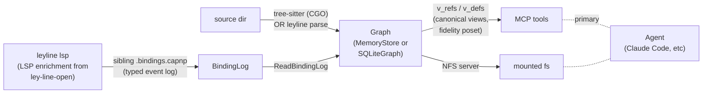

# Mache

Mache turns code and structured data into a navigable graph — functions, types, cross-references, and call chains — exposed as MCP tools or a mounted filesystem.

Point it at a codebase. It parses the code, discovers the structure, and lets your agent (or you) explore by following call chains, jumping to definitions, and reading context — instead of grepping through flat files.

> *Mache* (/mɑʃe/ *mah-shay*): from *papier-mâché* — raw material, crushed and remolded into shape.


## Quick start

```bash
git clone https://github.com/agentic-research/mache.git
cd mache && task build && task install
mache serve .
claude mcp add --transport http mache http://localhost:7532/mcp
```

That's the 30-second path. For the full first-run flow — install on Linux/macOS, Claude Desktop / stdio configs, mount as filesystem, write-back, schema inference, troubleshooting — see [GETTING-STARTED.md](GETTING-STARTED.md).

## What it gives an agent

Seventeen MCP tools wrap the projected graph (sixteen read-surface plus `write_file`). Fourteen work standalone; three (`semantic_search`, `get_type_info`, `get_diagnostics`) require [ley-line-open](https://github.com/agentic-research/ley-line-open) enrichment. `find_smells` covers nine structural code-smell rules (`dead_code`, `cyclomatic_complexity`, `god_file`, `fan_out_skew`, `untested_function`, …); four of those require a `.db` built by ley-line-open.

For the full tool inventory and capability matrix (which tools need which tables), see [ARCHITECTURE.md § MCP Server](docs/ARCHITECTURE.md#core-abstractions) and [§ Interplay with ley-line-open](docs/ARCHITECTURE.md#interplay-with-ley-line-open).

## How it works


```mermaid
flowchart LR
    Source["source dir"] -->|"tree-sitter (CGO)<br/>OR leyline parse"| Graph
    LSP["leyline lsp<br/>(LSP enrichment from<br/>ley-line-open)"] -->|"sibling .bindings.capnp<br/>(typed event log)"| BindingLog
    BindingLog -->|"ReadBindingLog"| Graph["Graph<br/>(MemoryStore or<br/>SQLiteGraph)"]
    Graph -->|"v_refs / v_defs<br/>(canonical views,<br/>fidelity poset)"| MCP["MCP tools"]
    Graph -->|"NFS server"| FS["mounted fs"]
    MCP -. "primary" .- Agent["Agent<br/>(Claude Code, etc)"]
    FS -.- Agent
```

1. **Parse** — tree-sitter parses source into AST nodes (28 languages). The modern path is `leyline parse` (from ley-line-open); CGO `SitterWalker` is the fallback.
1. **Infer** — schema inference (FCA + greedy entropy) discovers the natural groupings (`functions/`, `types/`, `classes/`)
1. **Link** — cross-reference extraction builds a call graph from identifiers and imports. When the LSP pass from ley-line-open has run, refs flow through a sibling `.bindings.capnp` typed event log (per [ADR-0013](docs/adr/0013-refs-defs-canonical-schema.md)) rather than SQL columns — the wire format is the cross-runtime contract.
1. **Project** — the graph is exposed as MCP tools (primary) or a mounted filesystem (optional)

The graph is the same on either path; MCP and the filesystem are two ways to talk to it.

## Status

| Capability                              | Status                                                                                           |
| --------------------------------------- | ------------------------------------------------------------------------------------------------ |
| Tree-sitter parsing (28 langs)          | Stable                                                                                           |
| MCP server (17 tools, stdio + HTTP)     | Stable                                                                                           |
| Cross-repo serve (`--mount NAME=PATH`)  | Stable (find_callers federates; find_callees stays per-mount for now)                            |
| Cross-references (callers/callees)      | Stable                                                                                           |
| `find_smells` (9 structural rules)      | Stable. `fan_out_skew` is qualifier-aware via ley-line-open `BindingRecord.qualifier`            |
| Canonical views (ADR-0013)              | Stable. `v_refs`/`v_defs` with fidelity poset (`mention` ⊑ `binding`)                            |
| Capnp event-log readthrough             | Stable. `${db}.bindings.capnp` is the cross-runtime contract for binding refs                    |
| E2E tool harness + flamegraphs          | Stable. `task profile-tools-pprof` + `task flamegraphs` produce per-tool pprof + SVG flamegraphs |
| `MemoryStore.{Defs,Refs}Map` cache      | Stable. Memoized snapshots; invalidated on AddDef / AddRef / DeleteFileNodes                     |
| NFS mount + write-back                  | Stable                                                                                           |
| Schema inference (FCA)                  | Beta                                                                                             |
| Community detection (Louvain)           | Beta                                                                                             |
| LSP enrichment (type info, diagnostics) | Optional — [ley-line-open](https://github.com/agentic-research/ley-line-open)                    |
| Semantic search (embeddings)            | Optional — [ley-line-open](https://github.com/agentic-research/ley-line-open)                    |

<details>
<summary>Why this exists</summary>

Agents operate without topology. They see flat files, grep for strings, build a mental model, forget it next turn, rebuild it. The structure is *in* the data — functions call other functions, types reference types, configs depend on configs — but nothing exposes it.

Mache does. Point it at data, it figures out the shape. Source code gets parsed by tree-sitter. JSON and YAML get walked. Schema inference discovers the natural groupings without config. The agent can then explore the topology directly: follow call chains, find definitions, read context, write back.

Built for agents first. The design choices — stable node paths across edits, identity-preserving write-back — exist because agents need to reference things reliably across turns. The outputs are human-discernible because the representations are filesystems and SQL, but the topology is the point.

</details>

<details>
<summary>The graph isomorphism argument</summary>

Both structured data and filesystems are graphs. Your JSON object has nodes and edges (containment). Your filesystem has nodes and edges (parent-child). They're isomorphic.

Operating systems never formalized this mapping. Mache does:

- SQL is the graph operator — queries define projections from one topology to another
- Schema defines topology — the formal specification of how source nodes map to filesystem nodes
- The filesystem exposes traversal primitives: `cd` traverses an edge, `ls` enumerates children, `cat` reads node data

[ADR-0011](docs/adr/0011-pointer-abstraction.md) takes this further: every navigable thing in mache (path, token, SHA, range, record, ref) is a Pointer; the graph is a network of pointers; mache resolves them on demand.

See [Architecture](docs/ARCHITECTURE.md) for the full picture.

</details>

## Deployment modes

Mache has two supported deployment shapes:

**Bundle / image (canonical production path).** Mache ships its own
[apko](https://github.com/chainguard-dev/apko) +
[melange](https://github.com/chainguard-dev/melange) configs to produce a
distroless OCI image (`mache:0.8.0`, ~33MB, x86_64 + aarch64). This is the
unit that a cluster orchestrator (e.g. cloister) deploys; inside the
bundle, mache speaks to a co-located ley-line daemon over a UDS socket
and is unreachable except via the orchestrator-mediated wire.

```bash
task image                          # → mache.tar (mache:0.8.0)
docker load -i mache.tar
docker run --rm -i mache:0.8.0 serve --stdio /path/to/source
```

Given a fixed `melange.rsa` signing key and pinned toolchain, the build is
reproducible — same input git tree, same image hash. `task image`
auto-generates a dev keypair when one is missing (APK signatures will
differ across freshly-generated keys), so for byte-stable artifacts in CI
inject a fixed keypair from a secret. The melange recipe builds with
`CGO_ENABLED=1` (required for the elixir tree-sitter binding); the leyline
FFI client is gated behind the `leyline` build tag and is **not** compiled
into the image (see [ADR-0006](docs/adr/0006-pure-go-mcp-first.md)).

**Local / dev path** — running `mache serve` or `mache mount` directly on
your machine. Useful for laptop work, debugging, and writing schemas. In
this mode mache may auto-discover or auto-download a `leyline` binary
(legacy code path; the bundle ships everything, so this only kicks in for
non-bundle invocations). Set `MACHE_NO_LEYLINE=1` to disable auto-download
in CI or when leyline-open hasn't published a release for your platform.
Exposing this mode externally requires a reverse proxy in front for auth;
mache itself does not implement perimeter auth (the bundle gets it from
the orchestrator).

## Docs

- [Getting started](GETTING-STARTED.md) — install + first run
- [Architecture](docs/ARCHITECTURE.md) — graph backends, write pipeline, virtual directories, ley-line-open interplay
- [Roadmap](docs/ROADMAP.md) — what's landed, near-term, long-term
- [ADRs](docs/adr/) — Architectural Decision Records
- [Prior art & landscape](docs/PRIOR_ART.md) — what mache builds on, how it compares
- [Example schemas](examples/README.md) — NVD, KEV, Go source, MCP registry
- [Contributing](CONTRIBUTING.md)

## License

Apache 2.0
