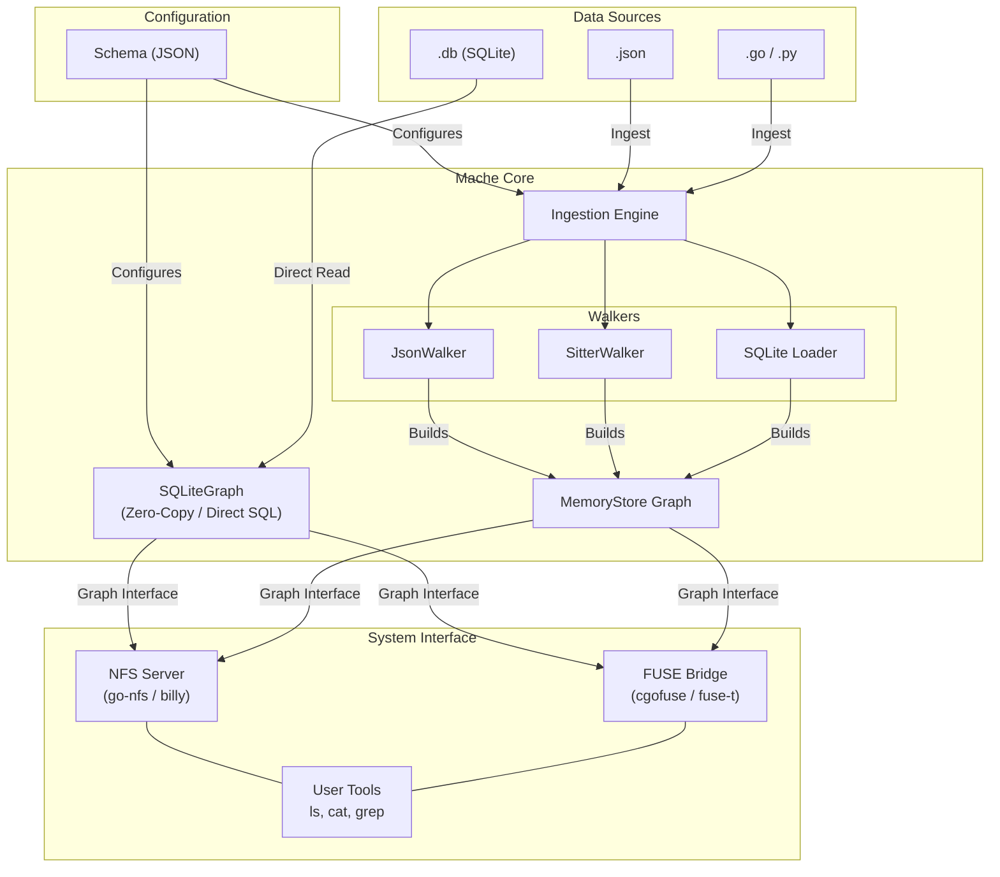

# Mache Architecture

## High-Level Design



There are two data paths depending on the source:

1. **SQLite direct (`.db` files)** — `SQLiteGraph` queries the source database directly. A one-pass scan builds the directory tree (~4s for 323K records), then content is resolved on demand via primary key lookup. No data is copied.
2. **Ingestion (`.json`, `.go`, `.py`)** — The `Engine` dispatches to the appropriate `Walker`, renders templates, and bulk-loads nodes into `MemoryStore`.

Both paths are fronted by the same `Graph` interface and served via either an **NFS server** (macOS default, `go-nfs` + `billy`) or a **FUSE bridge** (Linux default, `cgofuse` + `fuse-t`). A **Topology Schema** declares the directory structure using selectors and Go template strings for names/content.

With `--infer`, the schema itself can be derived automatically: the `lattice` package reservoir-samples records from a SQLite source, builds a Formal Concept Analysis lattice, and projects it into a valid `Topology` — detecting identifier fields, temporal shard levels, and leaf files without any hand-authored schema.

## Core Abstractions

- **`Walker` interface** — Abstracts over query engines. `JsonWalker` uses JSONPath; `SitterWalker` uses tree-sitter AST queries. Both return `Match` results with captured values and optional recursion context.
- **`Graph` interface** — Access to the node store (`GetNode`, `ListChildren`, `ReadContent`, `GetCallers`). Two implementations:
  - **`MemoryStore`** — In-memory map for small datasets (JSON files, source code).
  - **`SQLiteGraph`** — Direct SQL backend for `.db` sources. One-pass scan builds the directory tree; content resolved on demand via primary key lookup and template rendering. No data copied.
- **`Engine`** — Drives ingestion: walks files, dispatches to walkers, renders templates, builds the graph. Tracks source file paths for origin-aware nodes. Deduplicates same-name constructs (e.g. multiple `init()`) by appending `.from_<filename>` suffixes.
- **`GraphFS`** — NFS filesystem via `go-nfs`/`billy`. Adapts the `Graph` interface to `billy.Filesystem`. Default backend on macOS.
- **`MacheFS`** — FUSE implementation via cgofuse. Handle-based readdir with auto-mode for fuse-t compatibility. Extended cache timeouts (300s) for NFS performance. Default backend on Linux.

## Write Pipeline

When `--writable` is enabled, file nodes backed by tree-sitter source code become editable:

```
Agent opens file → writeHandle buffers → Agent closes file →
  Validate (tree-sitter) → Format (gofumpt) → Splice → Surgical update + ShiftOrigins
```

Key types:
- **`SourceOrigin`** (`graph.go`) — Tracks `FilePath`, `StartByte`, `EndByte` for each file node's position in its source.
- **`OriginProvider`** (`interfaces.go`) — Optional interface on `Match` to expose byte ranges from tree-sitter captures.
- **`Splice`** (`writeback/splice.go`) — Pure function: atomically replaces a byte range in a source file (temp file + rename).
- **`Validate`** (`writeback/validate.go`) — Tree-sitter syntax check before touching source.
- **`FormatGoBuffer`** (`writeback/format.go`) — In-process gofumpt (no external CLI, no offset drift).
- **`writeHandle`** / **`writeFile`** — Per-open-file buffer. On `Release`/`Close`: validate → format → splice → surgical node update → `ShiftOrigins` for siblings.

### Draft Mode

If validation fails, the write is saved as a **draft** — the node path remains stable, and the error is available via `_diagnostics/ast-errors`. The agent can read its broken code and fix it without losing the file path.

## Virtual Directories

### `_schema.json`
Root-level virtual file exposing the active topology as JSON.

### `_diagnostics/`
Per-directory virtual dir (writable mounts only) with `last-write-status`, `ast-errors`, and `lint` files.

### `context`
Per-directory virtual file exposing imports/globals visible to that scope. Critical for agents to understand dependencies without reading the whole file.

### `.query/`
Plan 9-style query directory at root. Create a query dir (`mkdir /.query/my_search`), write SQL to `ctl`, and results appear as symlinks back into the graph. Powered by the `mache_refs` virtual table.

### `callers/`
Per-directory virtual subdirectory exposing cross-references. For any directory node, `callers/` lists nodes that reference the token (function/method name) derived from the directory name. Self-gating: only appears when `GetCallers(token)` returns non-empty results.

- **NFS**: Entries are `graphFile`s — reading them returns the actual source content of the calling code.
- **FUSE**: Entries are symlinks pointing back into the graph (e.g., `../../../funcs/Main/source`).

```bash
# List callers of function Bar
ls /funcs/Bar/callers/
# → funcs_Foo_source

# NFS: read caller content directly
cat /funcs/Bar/callers/funcs_Foo_source
# → func Foo() { Bar() }

# FUSE: follow symlink
readlink /funcs/Bar/callers/funcs_Foo_source
# → ../../../funcs/Foo/source
```

## Key File Reference

| Concern | File | Key functions/types |
|---------|------|-------------------|
| CLI + mount wiring | `cmd/mount.go` | `rootCmd`, `--writable`, `--infer`, `--backend` flags |
| Schema types | `api/schema.go` | `Topology`, `Node`, `Leaf` |
| Ingestion orchestration | `internal/ingest/engine.go` | `Engine.Ingest`, `processNode`, `ingestTreeSitter`, `dedupSuffix` |
| JSON queries | `internal/ingest/json_walker.go` | `JsonWalker.Query` |
| Tree-sitter queries | `internal/ingest/sitter_walker.go` | `SitterWalker.Query`, `sitterMatch.CaptureOrigin` |
| Walker/Match contracts | `internal/ingest/interfaces.go` | `Walker`, `Match`, `OriginProvider` |
| SQLite streaming | `internal/ingest/sqlite_loader.go` | `StreamSQLiteRaw` |
| Graph (in-memory) | `internal/graph/graph.go` | `MemoryStore`, `Node`, `SourceOrigin`, `ContentRef` |
| Graph (SQLite direct) | `internal/graph/sqlite_graph.go` | `SQLiteGraph`, `EagerScan`, `GetCallers` |
| NFS backend | `internal/nfsmount/graphfs.go` | `GraphFS`, `graphFile`, `writeFile`, `callers/` |
| NFS server | `internal/nfsmount/server.go` | `NewServer`, NFS listener |
| FUSE backend | `internal/fs/root.go` | `MacheFS`, `writeHandle`, `callers/`, `.query/` |
| Source splicing | `internal/writeback/splice.go` | `Splice` |
| Validation | `internal/writeback/validate.go` | `Validate` |
| Formatting | `internal/writeback/format.go` | `FormatGoBuffer` |
| Cross-ref vtab | `internal/refsvtab/refs_module.go` | `mache_refs` virtual table |
| Control block | `internal/control/` | HotSwapGraph, live schema reload |
| Go schema | `examples/go-schema.json` | functions, methods, types, constants, variables, imports |
| FCA inference | `internal/lattice/` | `FormalContext`, `NextClosure`, `Project`, `Inferrer` |
| Build/test | `Taskfile.yml` | `task build`, `task test`, `task check` |

## Architectural Decision Records (ADRs)

| ADR | Status | Summary |
|-----|--------|---------|
| [0001: User-Space FUSE Bridge](adr/0001-user-space-fuse-bridge.md) | Accepted | fuse-t + cgofuse for macOS (no kexts) |
| [0002: Declarative Topology Schema](adr/0002-declarative-topology-schema.md) | Accepted | Schema-driven ingestion with Go templates |
| [0003: CAS & Layered Overlays](adr/0003-cas-layered-overlays.md) | Proposed | Content-Addressed Storage and Docker-style layers (ideated) |
| [0004: MVCC Memory Ledger](adr/0004-mvcc-memory-ledger.md) | Proposed | ECS + mmap + RCU for 10M+ entities (ideated) |
| [0005: FCA Schema Inference](adr/0005-fca-schema-inference.md) | Accepted | NextClosure on sampled records, bitmap-accelerated lattice → topology |
| [0006: Syntax-Aware Write Protection](adr/0006-syntax-aware-write-protection.md) | Accepted | Tree-sitter validation before source splice |
| [0007: Git Object Graph as FS Projection](adr/0007-git-object-graph-as-fs-projection.md) | Proposed | Git objects as first-class data source |
| [0008: Greedy Entropy Schema Inference](adr/0008-greedy-entropy-schema-inference.md) | Accepted | Information-theoretic field scoring for schema inference |
| [0009: AST-Aware Write Pipeline](adr/0009-ast-aware-write-pipeline.md) | Accepted | Validate → format → splice → surgical update (no re-ingest) |
