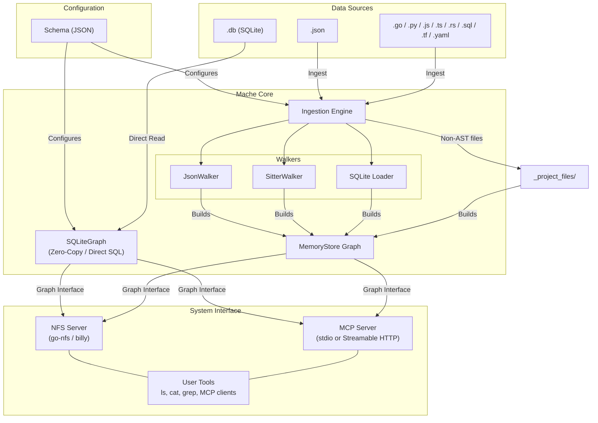

# Mache Architecture

## High-Level Design


```mermaid
graph TD
    subgraph Configuration
        Schema["Schema (JSON)"]
    end

    subgraph "Data Sources"
        SQLiteFile[".db (SQLite)"]
        FlatFile[".json"]
        SourceCode[".go / .py / .js / .ts / .rs / .sql / .tf / .yaml"]
    end

    subgraph "Mache Core"
        SQLiteGraph["SQLiteGraph<br/>(Zero-Copy / Direct SQL)"]
        Engine[Ingestion Engine]

        subgraph "Walkers"
            JW[JsonWalker]
            SW[SitterWalker]
            SL[SQLite Loader]
        end

        MemoryStore["MemoryStore Graph"]
    end

    subgraph "System Interface"
        NFS["NFS Server<br/>(go-nfs / billy)"]
        MCP["MCP Server<br/>(stdio or Streamable HTTP)"]
        Tools["User Tools<br/>ls, cat, grep, MCP clients"]
    end

    Schema -->|Configures| SQLiteGraph
    Schema -->|Configures| Engine

    SQLiteFile -->|Direct Read| SQLiteGraph
    FlatFile -->|Ingest| Engine
    SourceCode -->|Ingest| Engine

    Engine --> JW
    Engine --> SW
    Engine --> SL

    JW -->|Builds| MemoryStore
    SW -->|Builds| MemoryStore
    SL -->|Builds| MemoryStore
    Engine -->|"Non-AST files"| ProjectFiles["_project_files/"]
    ProjectFiles -->|Builds| MemoryStore

    SQLiteGraph -->|Graph Interface| NFS
    MemoryStore -->|Graph Interface| NFS
    SQLiteGraph -->|Graph Interface| MCP
    MemoryStore -->|Graph Interface| MCP

    NFS --- Tools
    MCP --- Tools
```

There are two data paths depending on the source:

1. **SQLite direct (`.db` files)** — `SQLiteGraph` queries the source database directly. A one-pass scan builds the directory tree (~12s for 323K records), then content is resolved on demand via primary key lookup. No data is copied.
1. **Ingestion** — The `Engine` dispatches to the appropriate `Walker`, renders templates, and bulk-loads nodes into `MemoryStore`. Supported formats include:
   - **Data**: `.json`, `.db` (SQLite)
   - **Code**: `.go`, `.py`, `.js`, `.ts`, `.tsx`, `.rs`, `.sql`
   - **Config**: `.tf`, `.hcl`, `.yaml`, `.yml`

Both paths are fronted by the same `Graph` interface and served via an **NFS server** (`go-nfs` + `billy`, pure Go, cross-platform). A **Topology Schema** declares the directory structure using selectors and Go template strings for names/content.

> Note: The earlier user-space FUSE bridge (`cgofuse` + `fuse-t`, ADR-0001) was removed in v0.7.0 in favor of the pure-Go NFS path (ADR-0006). For FUSE mounts today, use ley-line-open's `leyline serve`.

With `--infer`, the schema itself can be derived automatically: the `lattice` package reservoir-samples records from a SQLite source, builds a Formal Concept Analysis lattice, and projects it into a valid `Topology` — detecting identifier fields, temporal shard levels, and leaf files without any hand-authored schema.

## Core Abstractions

- **`Walker` interface** — Abstracts over query engines. `JsonWalker` uses JSONPath; `SitterWalker` uses tree-sitter AST queries. Both return `Match` results with captured values and optional recursion context.
- **`Graph` interface** — Access to the node store (`GetNode`, `ListChildren`, `ReadContent`, `GetCallers`). Two implementations:
  - **`MemoryStore`** — In-memory map for small datasets (JSON files, source code).
  - **`SQLiteGraph`** — Direct SQL backend for `.db` sources. One-pass scan builds the directory tree; content resolved on demand via primary key lookup and template rendering. No data copied.
- **`Engine`** — Drives ingestion: walks files, dispatches to walkers, renders templates, builds the graph. Tracks source file paths for origin-aware nodes. Deduplicates same-name constructs (e.g. multiple `init()`) by appending `.from_<filename>` suffixes.
- **`GraphFS`** — NFS filesystem via `go-nfs`/`billy`. Adapts the `Graph` interface to `billy.Filesystem`. The only mount backend (the earlier FUSE backend was removed in v0.7.0; see ADR-0006).
- **`_project_files/`** — Non-AST files (READMEs, configs, docs) encountered during tree-sitter ingestion are routed into a separate `_project_files/` tree via `ingestRawFileUnder()`. This preserves access to supporting files without polluting the AST-derived structure.
- **Friendly-name grouping** — `ProjectAST` in the lattice package maps raw tree-sitter node types to intuitive container directory names: `function_declaration` → `functions/`, `class_definition` → `classes/`, `type_declaration` → `types/`, etc. Language-specific containment rules nest methods inside classes for Python/TypeScript.
- **MCP Server** (`cmd/serve.go`) — `mache serve` exposes any graph as an MCP (Model Context Protocol) server. Two transports: stdio (default, client spawns mache as subprocess) and Streamable HTTP (`--http :PORT`, mache runs as an independent always-on process with stateful sessions). Sixteen tools wrap the `Graph` interface: `list_directory`, `read_file`, `find_callers`, `find_callees`, `find_definition`, `search`, `semantic_search`, `get_communities`, `get_overview`, `get_type_info`, `get_diagnostics`, `get_impact`, `get_architecture`, `get_diagram`, `write_file`, and `find_smells`. Several are conditional on backend capabilities (e.g., `search` requires `QueryRefs`, `write_file` requires `writeBacker`, LSP tools require `_lsp*` tables produced by ley-line-open). Uses `mark3labs/mcp-go` with lazy graph initialization for instant health-check response. No filesystem mount needed.
- **Community Detection** (`internal/graph/community.go`) — Louvain modularity optimization on the refs graph. Projects the bipartite token→nodeID refs into a unipartite co-reference graph (edge weight = shared tokens), then iteratively moves nodes between communities to maximize modularity. Also provides `ConnectedComponents` as a simpler baseline. Exposed via the `get_communities` MCP tool.

## Interplay with ley-line-open

Mache works standalone, but pairs with [ley-line-open](https://github.com/agentic-research/ley-line-open) (LLO) for the modern, CGO-free path. Two modes:

### Standalone (CGO tree-sitter, default for source mounts)

```
source dir → mache (Engine + SitterWalker + CGO tree-sitter) → MemoryStore → MCP / NFS
```

Mache parses source itself via the `SitterWalker` (tree-sitter grammars linked via CGO). The ingestion writes a sidecar SQLite with `nodes`, `node_refs`, `node_defs`, `file_index` — enough to power `find_callers`, `find_callees`, `search`, `find_definition`, `get_communities`, `get_impact`, and the four `find_smells` rules that operate on `node_defs`/`node_refs` (`dead_code`, `untested_function`, `fan_out_skew`, `duplicate_definitions`). No `_ast`, `_source`, or `_lsp*` tables are produced — the AST lives in memory, not on disk.

### LLO-paired (pure Go, pre-baked .db)

```
source dir → leyline parse (Rust tree-sitter) → .db with _ast / _source / node_refs / node_defs / _imports / _lsp* tables
                          ↓
mache (SQLiteGraph + ASTWalker, pure Go) → MCP / NFS
```

LLO's `leyline parse` produces a `.db` containing the full AST plus optional LSP enrichment. Mache's `SQLiteGraph` reads the file directly via `json_extract()` and lazy content resolution — no CGO tree-sitter, no in-memory AST, no re-parse. `ASTWalker` consumes `_ast` rows via SQL where the standalone path would invoke `SitterWalker`.

This is the path under [ADR-0006: Pure Go, MCP-First](adr/0006-pure-go-mcp-first.md). For mache binaries built without the tree-sitter CGO build tags, LLO is required.

### Tool capability matrix

| Tool                                                                                                  | Standalone (CGO) | LLO-paired (.db) | Notes                                                                |
| ----------------------------------------------------------------------------------------------------- | ---------------- | ---------------- | -------------------------------------------------------------------- |
| `list_directory`, `read_file`, `get_overview`, `get_diagram`                                          | ✓                | ✓                | Topology-only — works on any backend                                 |
| `find_callers`, `find_callees`, `find_definition`, `search`                                           | ✓                | ✓                | `node_refs` / `node_defs` populated by both paths                    |
| `get_communities`, `get_impact`, `get_architecture`                                                   | ✓                | ✓                | Derived from refs graph                                              |
| `write_file`                                                                                          | ✓                | ✓                | Splice pipeline runs on either backend (validate → format → splice)  |
| `find_smells` rules: `dead_code`, `untested_function`, `duplicate_definitions`, `fan_out_skew`        | ✓                | ✓                | Use `node_defs` / `node_refs` only                                   |
| `find_smells` rules: `magic_int_in_comparison`, `cyclomatic_complexity`, `long_function`, `long_file` | ✗                | ✓                | Need `_ast` table — only LLO writes it                               |
| `get_type_info`, `get_diagnostics`                                                                    | ✗                | ✓ (LSP-enriched) | Need `_lsp*` tables produced by ley-line's `lsp` crate at build time |
| `semantic_search`                                                                                     | ✗                | ✓ (with daemon)  | Embeddings via the LLO daemon UDS proxy                              |

When a tool falls into the second column without enrichment, the handler returns a friendly error message explaining how to enable it (typically: re-run `leyline parse` with the relevant flag).

## Write Pipeline

When `--writable` is enabled, file nodes backed by tree-sitter source code become editable:

```
Agent opens file → writeHandle buffers → Agent closes file →
  Validate (tree-sitter) → Format (gofumpt/hclwrite) → Splice → Surgical update + ShiftOrigins
```

Key types:

- **`SourceOrigin`** (`graph.go`) — Tracks `FilePath`, `StartByte`, `EndByte` for each file node's position in its source.
- **`OriginProvider`** (`interfaces.go`) — Optional interface on `Match` to expose byte ranges from tree-sitter captures.
- **`Splice`** (`writeback/splice.go`) — Pure function: atomically replaces a byte range in a source file (temp file + rename).
- **`Validate`** (`writeback/validate.go`) — Tree-sitter syntax check before touching source.
- **`FormatBuffer`** (`writeback/format.go`) — In-process formatting: gofumpt for Go, hclwrite for HCL/Terraform (no external CLI, no offset drift).
- **`writeHandle`** / **`writeFile`** — Per-open-file buffer. On `Release`/`Close`: validate → format → splice → surgical node update → `ShiftOrigins` for siblings.

### Draft Mode

If validation fails, the write is saved as a **draft** — the node path remains stable, and the error is available via `_diagnostics/ast-errors`. The agent can read its broken code and fix it without losing the file path.

## Virtual Directories

### `_schema.json`

Root-level virtual file exposing the active topology as JSON.

### `_diagnostics/`

Per-directory virtual dir (writable mounts only) with `last-write-status`, `ast-errors`, and `lint` files.

### `context`

Per-directory virtual file exposing imports/globals visible to that scope. Critical for agents to understand dependencies without reading the whole file.

### `.query/`

Plan 9-style query directory at root. Create a query dir (`mkdir /.query/my_search`), write SQL to `ctl`, and results appear as symlinks back into the graph. Powered by the `mache_refs` virtual table.

### `callers/`

Per-directory virtual subdirectory exposing cross-references. For any directory node, `callers/` lists nodes that reference the token (function/method name) derived from the directory name. Self-gating: only appears when `GetCallers(token)` returns non-empty results.

Entries are `graphFile`s — reading them returns the actual source content of the calling code.

```bash
# List callers of function Bar
ls /funcs/Bar/callers/
# → funcs_Foo_source

# Read caller content directly
cat /funcs/Bar/callers/funcs_Foo_source
# → func Foo() { Bar() }
```

### `callees/`

Per-directory virtual subdirectory exposing outgoing cross-references — the inverse of `callers/`. For any construct directory, `callees/` lists functions and types that the construct calls or references. Self-gating: only appears when `GetCallees(id)` returns non-empty results.

Resolution pipeline:

1. Find the `source` child of the construct directory
1. Extract qualified calls via tree-sitter (`CallExtractor` → `[]QualifiedCall`)
1. Resolve each call against the `defs` index: qualified lookup (`auth.Validate`) → import-path fallback → bare token lookup

Entries are `graphFile`s — reading returns the callee's source content.

```bash
# What does HandleRequest call?
ls /functions/HandleRequest/callees/
# → functions_ValidateToken_source  functions_WriteResponse_source

# Read callee source directly
cat /functions/HandleRequest/callees/functions_ValidateToken_source
# → func ValidateToken(tok string) error { ... }
```

## Key File Reference

| Concern                     | File                                                   | Key functions/types                                                                     |
| --------------------------- | ------------------------------------------------------ | --------------------------------------------------------------------------------------- |
| CLI + mount wiring          | `cmd/mount.go`                                         | `rootCmd`, `--writable`, `--infer`, `--backend` flags                                   |
| MCP server                  | `cmd/serve.go`                                         | `mache serve`, `registerMCPTools`, `buildServeGraph`, `lazyGraph`, 15 tool handlers     |
| Community detection         | `internal/graph/community.go`                          | `DetectCommunities` (Louvain), `ConnectedComponents`, `buildProjection`                 |
| Schema types                | `api/schema.go`                                        | `Topology`, `Node`, `Leaf`                                                              |
| Ingestion orchestration     | `internal/ingest/engine.go`                            | `Engine.Ingest`, `processNode`, `ingestTreeSitter`, `ingestRawFileUnder`, `dedupSuffix` |
| JSON queries                | `internal/ingest/json_walker.go`                       | `JsonWalker.Query`                                                                      |
| Tree-sitter queries         | `internal/ingest/sitter_walker.go`                     | `SitterWalker.Query`, `sitterMatch.CaptureOrigin`                                       |
| Walker/Match contracts      | `internal/ingest/interfaces.go`                        | `Walker`, `Match`, `OriginProvider`                                                     |
| SQLite streaming            | `internal/ingest/sqlite_loader.go`                     | `StreamSQLiteRaw`                                                                       |
| Graph (in-memory)           | `internal/graph/graph.go`                              | `MemoryStore`, `Node`, `SourceOrigin`, `ContentRef`, `GetCallees`, `AddDef`             |
| Graph (SQLite direct)       | `internal/graph/sqlite_graph.go`                       | `SQLiteGraph`, `EagerScan`, `GetCallers`, `GetCallees`                                  |
| NFS backend                 | `internal/nfsmount/graphfs.go`                         | `GraphFS`, `graphFile`, `writeFile`, `callers/`                                         |
| NFS server                  | `internal/nfsmount/server.go`                          | `NewServer`, NFS listener                                                               |
| Source splicing             | `internal/writeback/splice.go`                         | `Splice`                                                                                |
| Validation                  | `internal/writeback/validate.go`                       | `Validate`                                                                              |
| Formatting                  | `internal/writeback/format.go`                         | `FormatBuffer` (Go: gofumpt, HCL: hclwrite)                                             |
| Cross-ref vtab              | `internal/refsvtab/refs_module.go`                     | `mache_refs` virtual table                                                              |
| Control block               | `internal/control/`                                    | HotSwapGraph, live schema reload                                                        |
| Go schema                   | `examples/go-schema.json`                              | functions, methods, types, constants, variables, imports                                |
| MCP schemas                 | `examples/mcp-schema.json`, `mcp-registry-schema.json` | MCP server manifest and registry projection                                             |
| FCA inference               | `internal/lattice/`                                    | `FormalContext`, `NextClosure`, `Project`, `Inferrer`                                   |
| ProjectAST / friendly names | `internal/lattice/project_ast.go`                      | `ProjectAST`, `friendlyTypeNames`, containment rules                                    |
| Build/test                  | `Taskfile.yml`                                         | `task build`, `task test`, `task check`                                                 |

## Architectural Decision Records (ADRs)

| ADR                                                                                      | Status     | Summary                                                                      |
| ---------------------------------------------------------------------------------------- | ---------- | ---------------------------------------------------------------------------- |
| [0001: User-Space FUSE Bridge](adr/0001-user-space-fuse-bridge.md)                       | Superseded | fuse-t + cgofuse for macOS (no kexts) — replaced by NFS in v0.7.0 (see 0006) |
| [0002: Declarative Topology Schema](adr/0002-declarative-topology-schema.md)             | Accepted   | Schema-driven ingestion with Go templates                                    |
| [0003: CAS & Layered Overlays](adr/0003-cas-layered-overlays.md)                         | Proposed   | Content-Addressed Storage and Docker-style layers (ideated)                  |
| [0004: MVCC Memory Ledger](adr/0004-mvcc-memory-ledger.md)                               | Proposed   | ECS + mmap + RCU for 10M+ entities (ideated)                                 |
| [0005: FCA Schema Inference](adr/0005-fca-schema-inference.md)                           | Accepted   | NextClosure on sampled records, bitmap-accelerated lattice → topology        |
| [0006: Syntax-Aware Write Protection](adr/0006-syntax-aware-write-protection.md)         | Accepted   | Tree-sitter validation before source splice                                  |
| [0006: Pure Go, MCP-First](adr/0006-pure-go-mcp-first.md)                                | Accepted   | Drop CGO/FUSE; pre-baked .db via leyline; NFS-only mount (v0.7.0)            |
| [0007: Git Object Graph as FS Projection](adr/0007-git-object-graph-as-fs-projection.md) | Proposed   | Git objects as first-class data source                                       |
| [0008: Greedy Entropy Schema Inference](adr/0008-greedy-entropy-schema-inference.md)     | Accepted   | Information-theoretic field scoring for schema inference                     |
| [0009: AST-Aware Write Pipeline](adr/0009-ast-aware-write-pipeline.md)                   | Accepted   | Validate → format → splice → surgical update (no re-ingest)                  |
