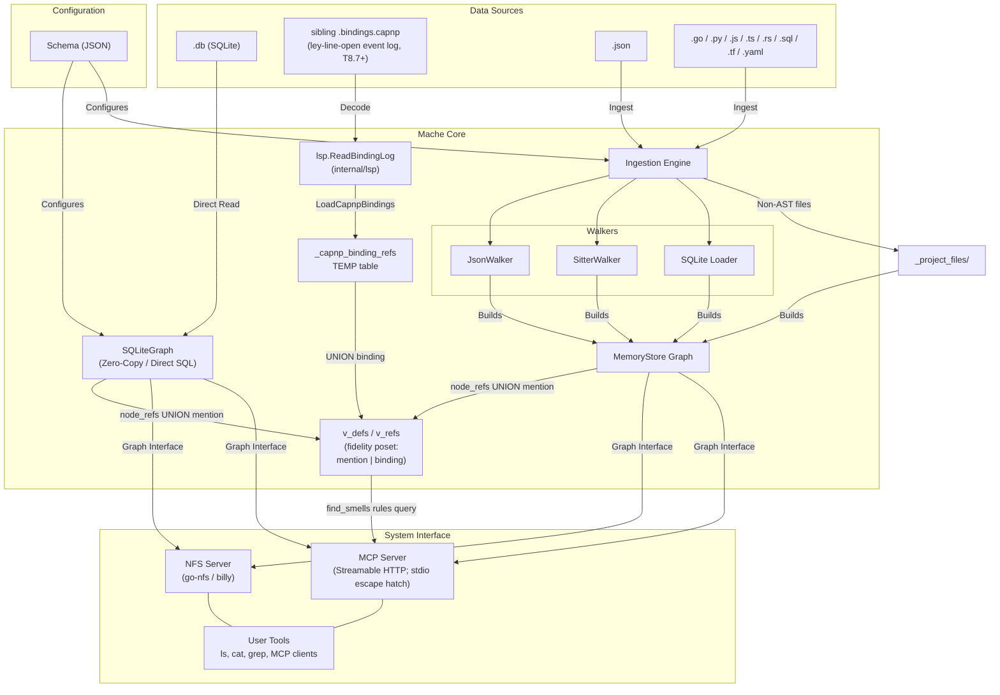
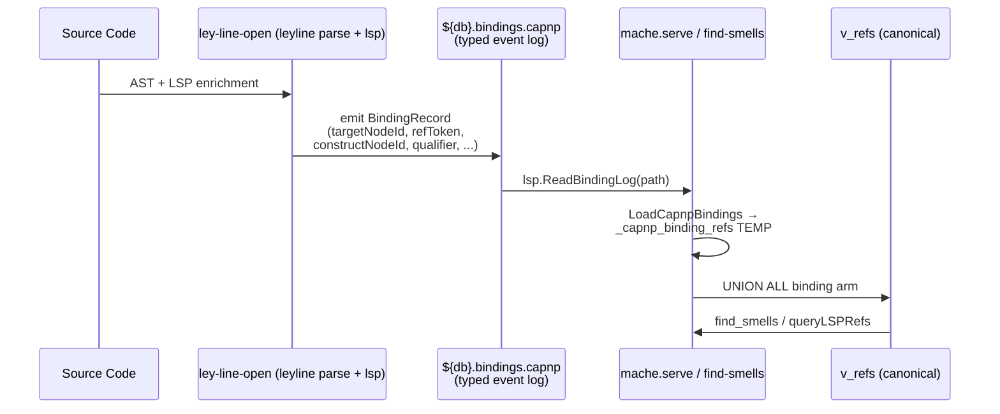

# Mache Architecture

This document is the architectural reference. If you're getting started for the first time, read [GETTING-STARTED.md](../GETTING-STARTED.md) first — it covers install, first-run, and common workflows.

If you're looking for:

- **Where things go** — see [Core Abstractions](#core-abstractions) and [Key File Reference](#key-file-reference)
- **Why mache works without ley-line-open and what changes when you have it** — see [Interplay with ley-line-open](#interplay-with-ley-line-open)
- **The write pipeline** — see [Write Pipeline](#write-pipeline)
- **Virtual directories (`callers/`, `callees/`, `_diagnostics/`)** — see [Virtual Directories](#virtual-directories)
- **Past decisions** — see [Architectural Decision Records (ADRs)](#architectural-decision-records-adrs)
- **Where things are going** — see [ROADMAP.md](ROADMAP.md)

## High-Level Design


```mermaid
graph TD
    subgraph Configuration
        Schema["Schema (JSON)"]
    end

    subgraph "Data Sources"
        SQLiteFile[".db (SQLite)"]
        BindingLog["sibling .bindings.capnp<br/>(ley-line-open event log, T8.7+)"]
        FlatFile[".json"]
        SourceCode[".go / .py / .js / .ts / .rs / .sql / .tf / .yaml"]
    end

    subgraph "Mache Core"
        SQLiteGraph["SQLiteGraph<br/>(Zero-Copy / Direct SQL)"]
        Engine[Ingestion Engine]

        subgraph "Walkers"
            JW[JsonWalker]
            SW[SitterWalker]
            SL[SQLite Loader]
        end

        MemoryStore["MemoryStore Graph"]

        BindingReader["lsp.ReadBindingLog<br/>(internal/lsp)"]
        CapnpTemp["_capnp_binding_refs<br/>TEMP table"]
        CanonView["v_defs / v_refs<br/>(fidelity poset:<br/>mention | binding)"]
    end

    subgraph "System Interface"
        NFS["NFS Server<br/>(go-nfs / billy)"]
        MCP["MCP Server<br/>(Streamable HTTP; stdio escape hatch)"]
        Tools["User Tools<br/>ls, cat, grep, MCP clients"]
    end

    Schema -->|Configures| SQLiteGraph
    Schema -->|Configures| Engine

    SQLiteFile -->|Direct Read| SQLiteGraph
    FlatFile -->|Ingest| Engine
    SourceCode -->|Ingest| Engine

    Engine --> JW
    Engine --> SW
    Engine --> SL

    JW -->|Builds| MemoryStore
    SW -->|Builds| MemoryStore
    SL -->|Builds| MemoryStore
    Engine -->|"Non-AST files"| ProjectFiles["_project_files/"]
    ProjectFiles -->|Builds| MemoryStore

    BindingLog -->|Decode| BindingReader
    BindingReader -->|LoadCapnpBindings| CapnpTemp
    CapnpTemp -->|UNION binding| CanonView
    SQLiteGraph -->|node_refs UNION mention| CanonView
    MemoryStore -->|node_refs UNION mention| CanonView

    SQLiteGraph -->|Graph Interface| NFS
    MemoryStore -->|Graph Interface| NFS
    SQLiteGraph -->|Graph Interface| MCP
    MemoryStore -->|Graph Interface| MCP
    CanonView -->|find_smells rules query| MCP

    NFS --- Tools
    MCP --- Tools
```

There are two data paths depending on the source:

1. **SQLite direct (`.db` files)** — `SQLiteGraph` queries the source database directly. A one-pass scan builds the directory tree (~12s for 323K records), then content is resolved on demand via primary key lookup. No data is copied.
1. **Ingestion** — The `Engine` dispatches to the appropriate `Walker`, renders templates, and bulk-loads nodes into `MemoryStore`. Two broad input classes:
   - **Structured data**: `.json`, `.db` (SQLite — handled by the streaming SQLite loader)
   - **Source code & config**: 28 tree-sitter languages, registered in [`internal/lang/lang.go`](../internal/lang/lang.go) — the single source of truth. Ingestion, the file watcher, schema presets, and write-back format gating all derive their dispatch tables from this one registry; consult it (not this doc) for the current language list.

Both paths are fronted by the same `Graph` interface and served via an **NFS server** (`go-nfs` + `billy`, pure Go, cross-platform). A **Topology Schema** declares the directory structure using selectors and Go template strings for names/content.

> Note: The earlier user-space FUSE bridge (`cgofuse` + `fuse-t`, ADR-0001) was removed in v0.7.0 in favor of the pure-Go NFS path (ADR-0006). For FUSE mounts today, use ley-line-open's `leyline serve`.

With `--infer`, the schema itself can be derived automatically: the `lattice` package reservoir-samples records from a SQLite source, builds a Formal Concept Analysis lattice, and projects it into a valid `Topology` — detecting identifier fields, temporal shard levels, and leaf files without any hand-authored schema.

## Core Abstractions

- **`Walker` interface** — Abstracts over query engines. `JsonWalker` uses JSONPath; `SitterWalker` uses tree-sitter AST queries. Both return `Match` results with captured values and optional recursion context.
- **`Graph` interface** — Access to the node store (`GetNode`, `ListChildren`, `ReadContent`, `GetCallers`). Two implementations:
  - **`MemoryStore`** — In-memory map for small datasets (JSON files, source code).
  - **`SQLiteGraph`** — Direct SQL backend for `.db` sources. One-pass scan builds the directory tree; content resolved on demand via primary key lookup and template rendering. No data copied.
- **`Engine`** — Drives ingestion: walks files, dispatches to walkers, renders templates, builds the graph. Tracks source file paths for origin-aware nodes. Deduplicates same-name constructs (e.g. multiple `init()`) by appending `.from_<filename>` suffixes.
- **`GraphFS`** — NFS filesystem via `go-nfs`/`billy`. Adapts the `Graph` interface to `billy.Filesystem`. The only mount backend (the earlier FUSE backend was removed in v0.7.0; see ADR-0006).
- **`_project_files/`** — Non-AST files (READMEs, configs, docs) encountered during tree-sitter ingestion are routed into a separate `_project_files/` tree via `ingestRawFileUnder()`. This preserves access to supporting files without polluting the AST-derived structure.
- **Friendly-name grouping** — `ProjectAST` in the lattice package maps raw tree-sitter node types to intuitive container directory names: `function_declaration` → `functions/`, `class_definition` → `classes/`, `type_declaration` → `types/`, etc. Language-specific containment rules nest methods inside classes for Python/TypeScript.
- **MCP Server** (`cmd/serve.go` entry; tool registration in `cmd/serve_handlers.go::registerMCPTools`; `lazyGraph` defined in `cmd/serve_registry.go`) — `mache serve` exposes any graph as an MCP (Model Context Protocol) server. Streamable HTTP is the canonical transport (`--http :PORT`, default `localhost:7532`): one always-on shared process with stateful sessions, routing each client to its project via the MCP roots protocol, registered by `mache init` (see ADR-0022). `--stdio` (client spawns mache as a subprocess) remains as an explicit escape hatch for CI / sandbox / headless use and is never registered for editor onboarding. Eighteen tools wrap the `Graph` interface: `list_directory`, `read_file`, `find_callers`, `find_callees`, `find_definition`, `search`, `semantic_search`, `get_communities`, `get_overview`, `get_sheaf_status`, `get_type_info`, `get_diagnostics`, `get_impact`, `get_architecture`, `get_diagram`, `resolve_ref`, `find_smells`, and `write_file`. Several are conditional on backend capabilities (e.g., `search` requires `QueryRefs`, `write_file` requires `writeBacker`, LSP tools require `_lsp*` tables produced by ley-line-open; `get_sheaf_status` talks to the ley-line daemon over UDS and returns `{available: false}` when it is unreachable). Uses `mark3labs/mcp-go` with lazy graph initialization for instant health-check response. No filesystem mount needed.
- **Community Detection** (`internal/graph/community.go`) — Louvain modularity optimization on the refs graph. Projects the bipartite token→nodeID refs into a unipartite co-reference graph (edge weight = shared tokens), then iteratively moves nodes between communities to maximize modularity. Also provides `ConnectedComponents` as a simpler baseline. Exposed via the `get_communities` MCP tool.

## Canonical Views & Capnp Event Log

Per [ADR-0013](adr/0013-refs-defs-canonical-schema.md) (fidelity poset over producers) and the cross-repo [ley-line-open ADR-0014](https://github.com/agentic-research/ley-line-open/blob/main/docs/adr/0014-capnp-as-protocol.md) (capnp as the consumer/producer contract), refs and defs flow through a **canonical view** layer that is producer-agnostic and pulls binding-fidelity data from a **typed capnp event log** rather than mache-specific SQL columns.

### Fidelity poset

```
L₀ (mention)  ⊑  L₁ (binding)  ⊑  L₂ (reachability — future)
```

- **`mention`** rows come from tree-sitter call extraction (`node_refs` table). Token textually appears at a referrer node; resolution to a target is best-effort (token equality + first-dot strip).
- **`binding`** rows come from ley-line-open's LSP pass via the sibling `.bindings.capnp` event log. Each `BindingRecord` carries `targetNodeId`, `refToken`, `constructNodeId`, `refSiteNodeId`, `refUri`, `refRange`, `parseGen`, and `qualifier` (T8.7).

The `v_refs` and `v_defs` views (created TEMP per-connection by `cmd/smell_refs_views.go::ensureCanonicalViews`) UNION the two arms with a `fidelity` discriminator column. Every `find_smells` rule queries `v_refs`/`v_defs` rather than `node_refs`/`node_defs` directly — adding a new producer (e.g. SSA) is a new UNION arm, not a fan-out across rules. Since v0.15.0 the mention arm also carries an additive, probe-guarded `node_hash` column: ley-line-open v0.6.0's merkle-AST producer writes a content-addressed `node_hash` (identical subtrees dedup to one `node_content` row), and `ensureCanonicalViews` surfaces it as a trailing column (`NULL` on older location-keyed `.db`s) without disturbing the poset — resolution still keys on `node_id`, never on the one-to-many `node_hash`.

### Capnp event log as protocol


```mermaid
sequenceDiagram
    participant Source as Source Code
    participant Leyline as ley-line-open (leyline parse + lsp)
    participant Log as ${db}.bindings.capnp<br/>(typed event log)
    participant Mache as mache.serve / find-smells
    participant View as v_refs (canonical)

    Source->>Leyline: AST + LSP enrichment
    Leyline->>Log: emit BindingRecord<br/>(targetNodeId, refToken,<br/>constructNodeId, qualifier, ...)
    Log->>Mache: lsp.ReadBindingLog(path)
    Mache->>Mache: LoadCapnpBindings →<br/>_capnp_binding_refs TEMP
    Mache->>View: UNION ALL binding arm
    View->>Mache: find_smells / queryLSPRefs
```

The wire format is back-to-back capnp segment messages; ley-line-open produces them via `capnp::serialize::write_message` and mache consumes them via `capnp.NewDecoder` (see `internal/lsp/binding_log.go`). The schema is byte-stable across additive field changes (ley-line-open ADR-0014; canonical encoding pinned at the capnp toolchain level).

### Why this matters

Before T8.8 (mache-6bd4d8), `v_refs` UNIONed an `_lsp_refs` SQL arm that depended on column names being the same on the producer and consumer side. A one-byte path mismatch in `_source.path` (the `be6136` incident) made every JOIN miss, silently degrading binding-fidelity rows to zero. Today the SQL `_lsp_refs` consumer arm is gone — all binding data flows through capnp records with typed accessors. A consumer typo on a field name fails at compile time, not at query-time on a misshapen JOIN.

### Schema dependency

Capnp schemas + Go bindings come from `github.com/agentic-research/ley-line-open/clients/go/leyline-schema` (multi-module monorepo, k8s.io/api style). One subpackage per schema: `common`, `binding`, `daemon`, `ast`, `head`, `source`. Schema bumps land upstream in ley-line-open; mache picks them up via `go get`. No in-tree fork, no regen target.

## Interplay with ley-line-open

Mache works standalone, but pairs with [ley-line-open](https://github.com/agentic-research/ley-line-open) for the modern, CGO-free path. Two modes:

### Standalone (CGO tree-sitter, fallback when leyline is unavailable)

```
source dir → mache (Engine + SitterWalker + CGO tree-sitter) → MemoryStore → MCP / NFS
```

Mache parses source itself via the `SitterWalker` (tree-sitter grammars linked via CGO). The ingestion writes a sidecar SQLite with `nodes`, `node_refs`, `node_defs`, `file_index` — enough to power `find_callers`, `find_callees`, `search`, `find_definition`, `get_communities`, `get_impact`, and the `find_smells` rules that operate on `node_defs`/`node_refs`/`nodes` (`dead_code`, `untested_function`, `fan_out_skew`, `duplicate_definitions`, `god_file`, `sleep_in_test`). No `_ast`, `_source`, or `_lsp*` tables are produced — the AST lives in memory, not on disk.

Per [ADR-0012](adr/0012-cgo-removal-migration.md) (steps 1–3 shipped; the step-4 *engine mechanism* now shipped too — the Engine gates the CGO parse on backend and serves context/imports/refs from SQL when an `ASTWalker` is present, byte-parity-proven), `mache build --backend=auto` (the default) prefers leyline when it is on `PATH` or at `~/.mache/bin/leyline`, and only falls back to this CGO path when leyline is unavailable. `--backend=tree-sitter` forces this path explicitly. The CGO path is scheduled for removal at the step-4 commitment point, now gated on production *activation* of the AST backend for source ingestion (wiring `SetASTWalker`), the deletion blockers, and leyline bundling (`mache-33dc5f`).

### ley-line-open-paired (pure Go, pre-baked .db)

```
source dir → leyline parse (Rust tree-sitter) → .db with _ast / _source / node_refs / node_defs / _imports / _lsp* tables
                          ↓
mache (SQLiteGraph + ASTWalker, pure Go) → MCP / NFS
```

ley-line-open's `leyline parse` produces a `.db` containing the full AST plus optional LSP enrichment. Mache's `SQLiteGraph` reads the file directly via `json_extract()` and lazy content resolution — no CGO tree-sitter, no in-memory AST, no re-parse. `ASTWalker` consumes `_ast` rows via SQL where the standalone path would invoke `SitterWalker`.

This is the path under [ADR-0006: Pure Go, MCP-First](adr/0006-pure-go-mcp-first.md). For mache binaries built without the tree-sitter CGO build tags, ley-line-open is required.

### OCI distribution

On release, mache self-publishes a leyline-bundled multi-arch image to `ghcr.io/agentic-research/mache` — the leyline binary ships inside the container, so a consumer running the image gets the ley-line-open-paired path with no runtime fetch (LLO with no network round-trip at startup). This image is `debian-slim` + `libsqlite3`, not the distroless [apko](https://github.com/chainguard-dev/apko)/[melange](https://github.com/chainguard-dev/melange) build described under [§ Deployment modes](../README.md#deployment-modes) — leyline links `libsqlite3` dynamically, which the distroless recipe doesn't carry, so distroless stays the local-dev/CI-bundle path and `debian-slim` is the leyline-bundled release path. Mache declares its own source via `server.json`'s `packages[].oci` entry in the ADR-0041 canonical form: a tagless `identifier` (`"ghcr.io/agentic-research/mache"`) plus a `version` that is the git tag (`"v0.16.2"`), so a resolver reads `identifier:version`. cloister's resolver then resolves tag→digest and pins `identifier@digest`; digest pinning / content-addressing is left to that consumer. (v0.16.1 briefly declared `version: "0.16.0"` against a `:v0.16.0` image — the tag-drift bug ADR-0041 rejected — reshaped here in v0.16.2.)

### Tool capability matrix

| Tool                                                                                                                        | Standalone (CGO) | ley-line-open-paired (.db) | Notes                                                                                                                                                                                                                                                           |
| --------------------------------------------------------------------------------------------------------------------------- | ---------------- | -------------------------- | --------------------------------------------------------------------------------------------------------------------------------------------------------------------------------------------------------------------------------------------------------------- |
| `list_directory`, `read_file`, `get_overview`, `get_diagram`                                                                | ✓                | ✓                          | Topology-only — works on any backend                                                                                                                                                                                                                            |
| `find_callers`, `find_callees`, `find_definition`, `search`                                                                 | ✓                | ✓                          | `node_refs` / `node_defs` populated by both paths                                                                                                                                                                                                               |
| `get_communities`, `get_impact`, `get_architecture`                                                                         | ✓                | ✓                          | Derived from refs graph                                                                                                                                                                                                                                         |
| `write_file`                                                                                                                | ✓                | ✓                          | Splice pipeline runs on either backend (validate → format → splice)                                                                                                                                                                                             |
| `find_smells` rules: `dead_code`, `untested_function`, `duplicate_definitions`, `fan_out_skew`, `god_file`, `sleep_in_test` | ✓                | ✓                          | Mention arm uses `node_defs` / `node_refs` / `nodes`. Binding arm consumes `${db}.bindings.capnp` when present (mache-6bd4d8). `fan_out_skew` is qualifier-aware via T8.7 (mache-6c0d07): projection-shape calls collapse to one qualifier instead of N tokens. |
| `find_smells` rules: `magic_int_in_comparison`, `cyclomatic_complexity`, `long_function`, `long_file`, `duplicate_code`     | ✗                | ✓                          | Need `_ast` table — only ley-line-open writes it                                                                                                                                                                                                                |
| `find_smells` rules: `drift_doc_broken_internal_link`, `drift_doc_dead_symbol_reference`, `drift_doc_outdated_count`        | ✓                | ✓                          | v1 placeholders (ADR-0018) — appear in the rule listing, currently return zero findings pending firing-logic follow-ups under mache-e1b6c8                                                                                                                      |
| `get_type_info`, `get_diagnostics`                                                                                          | ✗                | ✓ (LSP-enriched)           | Need `_lsp*` tables produced by ley-line's `lsp` crate at build time                                                                                                                                                                                            |
| `find_callers` (LSP-resolved targets via `queryLSPRefs`)                                                                    | ✓ (mention only) | ✓                          | Reads sibling `.bindings.capnp` first; legacy SQL `_lsp_refs` only as fallback for pre-T8.2 `.db`s.                                                                                                                                                             |
| `semantic_search`                                                                                                           | ✗                | ✓ (with daemon)            | Embeddings via the ley-line-open daemon UDS proxy                                                                                                                                                                                                               |

When a tool falls into the second column without enrichment, the handler returns a friendly error message explaining how to enable it (typically: re-run `leyline parse` with the relevant flag).

## Write Pipeline

When `--writable` is enabled, file nodes backed by tree-sitter source code become editable:

```
Agent opens file → writeHandle buffers → Agent closes file →
  Validate (tree-sitter) → Format (gofumpt/hclwrite) → Splice → Surgical update + ShiftOrigins
```

Key types:

- **`SourceOrigin`** (`graph.go`) — Tracks `FilePath`, `StartByte`, `EndByte` for each file node's position in its source.
- **`OriginProvider`** (`interfaces.go`) — Optional interface on `Match` to expose byte ranges from tree-sitter captures.
- **`Splice`** (`writeback/splice.go`) — Pure function: atomically replaces a byte range in a source file (temp file + rename).
- **`Validate`** (`writeback/validate.go`) — Tree-sitter syntax check before touching source.
- **`FormatBuffer`** (`writeback/format.go`) — In-process formatting: gofumpt for Go, hclwrite for HCL/Terraform (no external CLI, no offset drift).
- **`writeHandle`** / **`writeFile`** — Per-open-file buffer. On `Release`/`Close`: validate → format → splice → surgical node update → `ShiftOrigins` for siblings.

### Draft Mode

If validation fails, the write is saved as a **draft** — the node path remains stable, and the error is available via `_diagnostics/ast-errors`. The agent can read its broken code and fix it without losing the file path.

## Cross-repo serve (`--mount`)

`mache serve` accepts repeatable `--mount NAME=PATH` flags to compose multiple per-source graphs into a single `CompositeGraph`. Use it when you want one MCP endpoint to span several codebases — e.g., `auth-svc` and `billing-svc`, or a core library plus its tests, or a mix of source repos and pre-baked `.db` files.

```bash
mache serve --mount auth=./auth-svc --mount billing=./billing-svc
```

Under the composite:

- **Each mount becomes a top-level virtual directory.** `list_directory ""` returns `[auth, billing]`. Per-mount paths are namespaced as `mount-name/path/inside/repo`.
- **`find_callers` federates across mounts.** Calling `find_callers Validate` walks every registered mount and merges the results. The response shape switches to objects carrying an explicit `mount` field so agents don't have to parse node IDs:
  ```json
  {
    "callers": [
      {"path": "auth/functions/AuthCaller/source", "mount": "auth"},
      {"path": "billing/functions/Charge/source",  "mount": "billing"}
    ]
  }
  ```
- **`get_node` / `read_file` / `find_callees` route by prefix.** A path with no recognized mount prefix returns `ErrNotFound`.
- **Single-source serves are unchanged.** Without `--mount`, the response shape and behavior are byte-identical to before.

`CompositeGraph` is the existing internal primitive that powers this — `internal/graph/composite.go`. It supports dynamic `Mount`/`Unmount`, has a recursion guard against mounted graphs that delegate back, and uses a stable `mountTime` so NFS attribute caches don't churn on every readdir.

This is the first concrete implementation of the **`Ref` pointer kind** from [ADR-0011](adr/0011-pointer-abstraction.md): a name-scoped pointer that resolves through a registry of named graphs.

**What's wired today (was tracked under `mache-iegm`):**

- **Cross-repo `find_callees` resolution.** When a function in mount A calls a function defined in mount B, `CompositeGraph.GetCallees` runs a phase-2 cross-mount pass via `crossMountCallees()` (`internal/graph/composite.go`): re-extracts calls from the source, resolves each token against the federated `DefsMap` across all mounts, and returns the cross-mount matches alongside any local resolution. Pinned by `TestFindCallees_CrossMountResolvesAndAnnotates`.
- **`find_definition` mount annotation.** Same `{path, mount}` shape as `find_callers`. The wiring goes through `lazyGraph.MountPrefixOf` so the annotation reaches handlers despite the wrapper.
- **`find_callers` mount annotation.** Federates across mounts and emits the annotated shape when any result carries a mount prefix.

**What's still not wired:**

- `search` and `get_impact` mount annotation — same idea, lower priority. `search role=reference` and `get_impact` still emit the legacy single-string shape on cross-mount results.

## Virtual Directories

### `_schema.json`

Root-level virtual file exposing the active topology as JSON.

### `_diagnostics/`

Per-directory virtual dir (writable mounts only) with `last-write-status`, `ast-errors`, and `lint` files.

### `context`

Per-directory virtual file exposing imports/globals visible to that scope. Critical for agents to understand dependencies without reading the whole file.

### `callers/`

Per-directory virtual subdirectory exposing cross-references. For any directory node, `callers/` lists nodes that reference the token (function/method name) derived from the directory name. Self-gating: only appears when `GetCallers(token)` returns non-empty results.

Entries are `graphFile`s — reading them returns the actual source content of the calling code.

```bash
# List callers of function Bar
ls /funcs/Bar/callers/
# → funcs_Foo_source

# Read caller content directly
cat /funcs/Bar/callers/funcs_Foo_source
# → func Foo() { Bar() }
```

### `callees/`

Per-directory virtual subdirectory exposing outgoing cross-references — the inverse of `callers/`. For any construct directory, `callees/` lists functions and types that the construct calls or references. Self-gating: only appears when `GetCallees(id)` returns non-empty results.

Resolution pipeline:

1. Find the `source` child of the construct directory
1. Extract qualified calls via tree-sitter (`CallExtractor` → `[]QualifiedCall`)
1. Resolve each call against the `defs` index: qualified lookup (`auth.Validate`) → import-path fallback → bare token lookup

Entries are `graphFile`s — reading returns the callee's source content.

```bash
# What does HandleRequest call?
ls /functions/HandleRequest/callees/
# → functions_ValidateToken_source  functions_WriteResponse_source

# Read callee source directly
cat /functions/HandleRequest/callees/functions_ValidateToken_source
# → func ValidateToken(tok string) error { ... }
```

## Key File Reference

| Concern                       | File                                                                                | Key functions/types                                                                                                                                                                                                                                                                                                                                                                                                                                                                                                                        |
| ----------------------------- | ----------------------------------------------------------------------------------- | ------------------------------------------------------------------------------------------------------------------------------------------------------------------------------------------------------------------------------------------------------------------------------------------------------------------------------------------------------------------------------------------------------------------------------------------------------------------------------------------------------------------------------------------ |
| CLI + mount wiring            | `cmd/mount.go`                                                                      | `rootCmd`, `--writable`, `--infer`, `--backend` flags                                                                                                                                                                                                                                                                                                                                                                                                                                                                                      |
| MCP server                    | `cmd/serve.go`, `cmd/serve_handlers.go`, `cmd/serve_registry.go`                    | `mache serve` (entry); `registerMCPTools` registers 18 tool handlers; `lazyGraph` is in serve_registry.go; `buildServeGraph` orchestrates ingestion                                                                                                                                                                                                                                                                                                                                                                                        |
| Community detection           | `internal/graph/community.go`                                                       | `DetectCommunities` (Louvain), `ConnectedComponents`, `buildProjection`                                                                                                                                                                                                                                                                                                                                                                                                                                                                    |
| Schema types                  | `api/schema.go`                                                                     | `Topology`, `Node`, `Leaf`                                                                                                                                                                                                                                                                                                                                                                                                                                                                                                                 |
| Ingestion orchestration       | `internal/ingest/engine.go`                                                         | `Engine.Ingest`, `processNode`, `ingestTreeSitter`, `ingestRawFileUnder`, `dedupSuffix`                                                                                                                                                                                                                                                                                                                                                                                                                                                    |
| JSON queries                  | `internal/ingest/json_walker.go`                                                    | `JsonWalker.Query`                                                                                                                                                                                                                                                                                                                                                                                                                                                                                                                         |
| Tree-sitter queries           | `internal/ingest/sitter_walker.go`                                                  | `SitterWalker.Query`, `sitterMatch.CaptureOrigin`                                                                                                                                                                                                                                                                                                                                                                                                                                                                                          |
| Walker/Match contracts        | `internal/ingest/interfaces.go`                                                     | `Walker`, `Match`, `OriginProvider`                                                                                                                                                                                                                                                                                                                                                                                                                                                                                                        |
| SQLite streaming              | `internal/ingest/sqlite_loader.go`                                                  | `StreamSQLiteRaw`                                                                                                                                                                                                                                                                                                                                                                                                                                                                                                                          |
| Graph (in-memory)             | `internal/graph/graph.go`                                                           | `MemoryStore`, `Node`, `SourceOrigin`, `ContentRef`, `GetCallees`, `AddDef`                                                                                                                                                                                                                                                                                                                                                                                                                                                                |
| Graph (SQLite direct)         | `internal/graph/sqlite_graph.go`                                                    | `SQLiteGraph`, `EagerScan`, `GetCallers`, `GetCallees`                                                                                                                                                                                                                                                                                                                                                                                                                                                                                     |
| NFS backend                   | `internal/nfsmount/graphfs.go`                                                      | `GraphFS`, `graphFile`, `writeFile`, `callers/`                                                                                                                                                                                                                                                                                                                                                                                                                                                                                            |
| NFS server                    | `internal/nfsmount/server.go`                                                       | `NewServer`, NFS listener                                                                                                                                                                                                                                                                                                                                                                                                                                                                                                                  |
| Source splicing               | `internal/writeback/splice.go`                                                      | `Splice`                                                                                                                                                                                                                                                                                                                                                                                                                                                                                                                                   |
| Validation                    | `internal/writeback/validate.go`                                                    | `Validate`                                                                                                                                                                                                                                                                                                                                                                                                                                                                                                                                 |
| Formatting                    | `internal/writeback/format.go`                                                      | `FormatBuffer` (Go: gofumpt, HCL: hclwrite)                                                                                                                                                                                                                                                                                                                                                                                                                                                                                                |
| Cross-ref vtab                | `internal/refsvtab/refs_module.go`                                                  | `mache_refs` virtual table                                                                                                                                                                                                                                                                                                                                                                                                                                                                                                                 |
| Capnp binding-log reader      | `internal/lsp/binding_log.go`                                                       | `Binding`, `ReadBindingLog`, `IterateBindingLog`, `SiblingBindingLogPath`                                                                                                                                                                                                                                                                                                                                                                                                                                                                  |
| Capnp schema module           | `github.com/agentic-research/ley-line-open/clients/go/leyline-schema`               | `binding.BindingRecord`, `common.{Range,Position}`, `daemon.*` — upstream multi-module pkg, no in-tree fork                                                                                                                                                                                                                                                                                                                                                                                                                                |
| Canonical views + readthrough | `cmd/smell_refs_views.go`                                                           | `ensureCanonicalViews`, `LoadCapnpBindings`, `_capnp_binding_refs` TEMP table, additive `node_hash` passthrough                                                                                                                                                                                                                                                                                                                                                                                                                            |
| E2E tool harness              | `cmd/all_tools_e2e_test.go`                                                         | `TestE2E_AllMCPTools`, `profileTool`, `capturePprof`, `writeE2EFixture`                                                                                                                                                                                                                                                                                                                                                                                                                                                                    |
| Snapshot caching contract     | `internal/graph/snapshot_cache_test.go`                                             | `TestDefsMap_*`, `TestRefsMap_*`, `TestSnapshotCache_ConcurrentReadersGetConsistentSnapshot`                                                                                                                                                                                                                                                                                                                                                                                                                                               |
| Control block                 | `internal/control/`                                                                 | `Controller`, `GetCurrentRoot`, `GetArenaPath`. Substrate identity is BLAKE3 `current_root`; paired with [ley-line-open](https://github.com/agentic-research/ley-line-open) ≥ v0.2.0.                                                                                                                                                                                                                                                                                                                                                      |
| UDS query proxy               | `cmd/uds_graph.go`, `cmd/serve.go::buildControlGraph`, `cmd/mount.go::mountControl` | `udsGraph` implements `graph.Graph` over a UDS socket to the ley-line daemon. Used by both `serve --control` and `mount --control` (read-only). The daemon owns SQLite (zero-copy via `sqlite3_deserialize` on the arena); mache never opens SQLite on these paths, eliminating the prior 352MB `ExtractActiveDB` temp-copy. `GetCallees` resolves via the `find_callees` daemon op (LLO 0.2.2+). Writable mount still uses `ExtractActiveDB` + `OpenWritableGraph` because splice-on-close write-back needs an in-process SQL connection. |
| Go schema                     | `examples/go-schema.json`                                                           | functions, methods, types, constants, variables, imports                                                                                                                                                                                                                                                                                                                                                                                                                                                                                   |
| MCP schemas                   | `examples/mcp-schema.json`, `mcp-registry-schema.json`                              | MCP server manifest and registry projection                                                                                                                                                                                                                                                                                                                                                                                                                                                                                                |
| FCA inference                 | `internal/lattice/`                                                                 | `FormalContext`, `NextClosure`, `Project`, `Inferrer`                                                                                                                                                                                                                                                                                                                                                                                                                                                                                      |
| ProjectAST / friendly names   | `internal/lattice/project_ast.go`                                                   | `ProjectAST`, `friendlyTypeNames`, containment rules                                                                                                                                                                                                                                                                                                                                                                                                                                                                                       |
| Build/test                    | `Taskfile.yml`                                                                      | `task build`, `task test`, `task check`                                                                                                                                                                                                                                                                                                                                                                                                                                                                                                    |

## E2E Tool Harness + Profiling

Per `mache-6b6da6` (phases 1-3 shipped), `cmd/all_tools_e2e_test.go` exercises every registered MCP tool against a multi-package Go fixture and emits per-tool latency + allocation deltas. Three task entry points:

- **`task profile-tools`** — latency + alloc-delta only. ~0.6s. Suitable for fast pre-merge feedback.
- **`task profile-tools-pprof`** — adds `runtime/pprof` CPU + heap capture per tool. Three artifacts per tool: `<tool>.cpu.pprof`, `<tool>.heap.pprof` (after iteration loop), `<tool>.heap.baseline.pprof` (before loop, for delta).
- **`task flamegraphs`** — renders SVG flamegraphs from the pprof artifacts via brendangregg's `flamegraph.pl` + `stackcollapse-go.pl` (install: `brew install flamegraph` on macOS). Heap flamegraphs use the baseline + `pprof -alloc_space -base=...` to subtract package-init noise; CPU flamegraphs use raw stacks.

Outputs land under `.e2e/` (gitignored). `INDEX.md` links each tool to its profiles + flamegraphs.

The harness runs by default during `go test ./...` and skips when `-short` is provided (`testing.Short()` triggers `t.Skip`). CI gates the cache contract via `internal/graph/snapshot_cache_test.go` (see below) — not the empirical numbers, which would be flaky across runners.

### `MemoryStore.{Defs,Refs}Map` memoization

Surfaced by the harness's heap-delta flamegraphs: `DefsMap` was 52% of `get_impact`'s heap delta and 32% of `get_overview`'s. Each call deep-copied the whole map plus one slice per entry; on real workloads (10K+ constructs, 50K+ ref tokens) that's millions of allocs per call.

Implementation: `atomic.Pointer` holds the cached snapshot. AddDef / AddRef / DeleteFileNodes invalidate under the existing write lock; readers double-check inside RLock to prevent torn snapshots. Returned map must be treated as read-only — every existing caller is.

Empirical impact (post-cache, same fixture):

| Tool                               | Heap-delta drop                                                                   |
| ---------------------------------- | --------------------------------------------------------------------------------- |
| `get_impact`                       | -45% (DefsMap dropped from top-3 allocators)                                      |
| `get_architecture`                 | -34%                                                                              |
| `get_overview` / `get_communities` | shape change — DefsMap/RefsMap gone, harness pprof + JSON marshaling now dominate |

The remaining heap is harness overhead (`runtime/pprof.StartCPUProfile`, `compress/flate` from profile writing) and `encoding/json.MarshalIndent` for response serialization — not caching candidates we control.

## Architectural Decision Records (ADRs)

| ADR                                                                                      | Status                                                 | Summary                                                                                                                                                                                                                                                                                                                                                                                                                                       |
| ---------------------------------------------------------------------------------------- | ------------------------------------------------------ | --------------------------------------------------------------------------------------------------------------------------------------------------------------------------------------------------------------------------------------------------------------------------------------------------------------------------------------------------------------------------------------------------------------------------------------------- |
| [0001: User-Space FUSE Bridge](adr/0001-user-space-fuse-bridge.md)                       | Superseded                                             | fuse-t + cgofuse for macOS (no kexts) — replaced by NFS in v0.7.0 (see 0006)                                                                                                                                                                                                                                                                                                                                                                  |
| [0002: Declarative Topology Schema](adr/0002-declarative-topology-schema.md)             | Accepted                                               | Schema-driven ingestion with Go templates                                                                                                                                                                                                                                                                                                                                                                                                     |
| [0003: CAS & Layered Overlays](adr/0003-cas-layered-overlays.md)                         | Proposed                                               | Content-Addressed Storage and Docker-style layers (ideated)                                                                                                                                                                                                                                                                                                                                                                                   |
| [0004: MVCC Memory Ledger](adr/0004-mvcc-memory-ledger.md)                               | Proposed                                               | ECS + mmap + RCU for 10M+ entities (ideated)                                                                                                                                                                                                                                                                                                                                                                                                  |
| [0005: FCA Schema Inference](adr/0005-fca-schema-inference.md)                           | Accepted                                               | NextClosure on sampled records, bitmap-accelerated lattice → topology                                                                                                                                                                                                                                                                                                                                                                         |
| [0006: Pure Go, MCP-First](adr/0006-pure-go-mcp-first.md)                                | Accepted                                               | Drop CGO/FUSE; pre-baked .db via leyline; NFS-only mount (v0.7.0)                                                                                                                                                                                                                                                                                                                                                                             |
| [0007: Git Object Graph as FS Projection](adr/0007-git-object-graph-as-fs-projection.md) | Proposed                                               | Git objects as first-class data source                                                                                                                                                                                                                                                                                                                                                                                                        |
| [0008: Greedy Entropy Schema Inference](adr/0008-greedy-entropy-schema-inference.md)     | Accepted                                               | Information-theoretic field scoring for schema inference                                                                                                                                                                                                                                                                                                                                                                                      |
| [0009: AST-Aware Write Pipeline](adr/0009-ast-aware-write-pipeline.md)                   | Accepted                                               | Validate → format → splice → surgical update (no re-ingest)                                                                                                                                                                                                                                                                                                                                                                                   |
| [0010: Hosted Mache Architecture](adr/0010-hosted-mache-architecture.md)                 | Proposed                                               | Hosted-mode design (cluster, R2, BYO storage)                                                                                                                                                                                                                                                                                                                                                                                                 |
| [0011: Pointer Abstraction](adr/0011-pointer-abstraction.md)                             | Proposed                                               | Path/token/SHA/range/record/ref/trace/embedding all unified as Pointer                                                                                                                                                                                                                                                                                                                                                                        |
| [0012: CGO Removal Migration](adr/0012-cgo-removal-migration.md)                         | Accepted (steps 1–3 + step-4 engine mechanism shipped) | Delegate parsing to ley-line entirely; retire SitterWalker + tree-sitter dep                                                                                                                                                                                                                                                                                                                                                                  |
| [0013: Refs/Defs Canonical Schema](adr/0013-refs-defs-canonical-schema.md)               | Accepted (shipped end-to-end)                          | Fidelity poset (`mention` ⊑ `binding`), `v_refs`/`v_defs` views, capnp readthrough                                                                                                                                                                                                                                                                                                                                                            |
| ley-line-open 0014: Capnp as Protocol (cross-repo)                                       | Accepted (ley-line-open)                               | Producer-side: typed event log replaces SQL columns as cross-runtime contract; canonical encoding gives byte-stability across additive schema changes. See `ley-line-open/docs/adr/0014-capnp-as-protocol.md`.                                                                                                                                                                                                                                |
| [0014: Mache in the Constellation](adr/0014-mache-in-constellation.md)                   | Proposed                                               | Locates mache as the structural-observation producer in the constellation (rosary observation-lattice, cloister CAS+bundle, ley-line-open capnp protocol). Frames the existing sheaf/CAS/git-ingestion beads as steps of one design rather than independent items.                                                                                                                                                                            |
| [0015: Syntax-Aware Write Protection](adr/0015-syntax-aware-write-protection.md)         | Accepted                                               | Tree-sitter validation before source splice (renumbered from 0006 to resolve a collision with the pure-Go/MCP-first ADR)                                                                                                                                                                                                                                                                                                                      |
| [0016: Cross-Language Reference Resolver](adr/0016-cross-language-reference-resolver.md) | Proposed                                               | Open scheme registry + resolvers as Kleisli arrows in an effects monad + product fidelity poset (`L_src × L_tgt`) extending ADR-0013. Cross-language refs as a Grothendieck fibration over the scheme category; not a sheaf — separated presheaf sheafified by ADR-0014's `current_root` advance. Drops "we project, we don't index" and the unqualified "monorepo = polyrepo" claim. 5-bead implementation sequence under epic `mache-q43l`. |
